# Admin Workflows Documentation

## Overview
This document details the administrative workflows and management interfaces for platform administrators in BenchWarmers, a B2B talent marketplace connecting companies with benched professionals to organisations seeking specialised skills.

## Admin Dashboard Overview

### Main Dashboard Metrics

| Metric | Value | Change |
|--------|-------|--------|
| **Active Companies** | 1,247 | +23 vs last month |
| **Active Engagements** | 89 | +12 vs last week |
| **Monthly Revenue** | $127,450 | +8.5% vs last month |
| **Platform Health** | 99.2% | uptime |

### Key Performance Indicators (KPIs)
- **Company Growth**: New registrations, verification rates
- **Engagement Metrics**: Active projects, completion rates
- **Financial Health**: Revenue, payment processing, disputes
- **System Performance**: API response times, error rates
- **User Satisfaction**: Support tickets, feedback scores

## Company Management Workflows

### 1. Company Verification Process

#### 1.1 Verification Queue Management
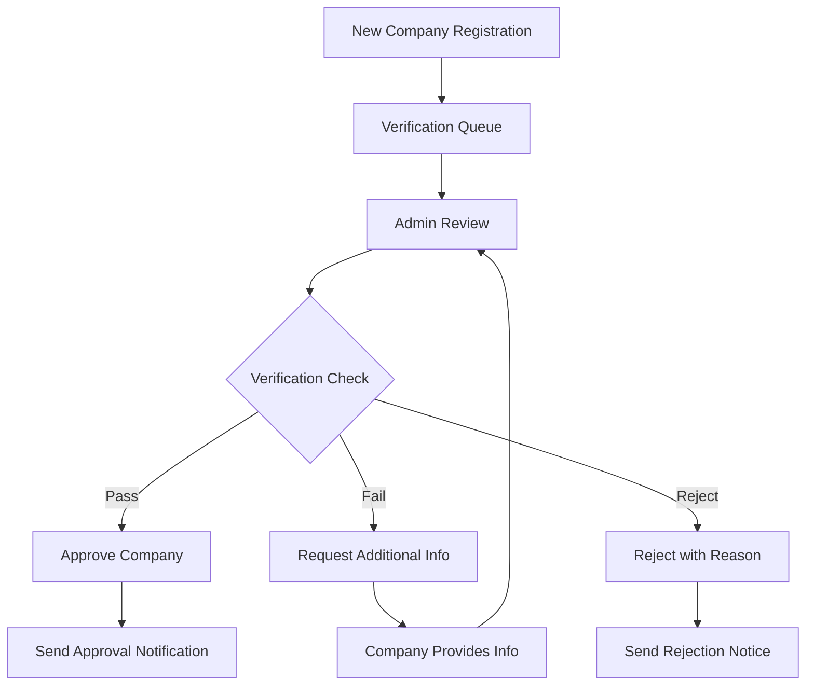

**Verification Criteria:**
- **Domain Ownership**: DNS verification or email confirmation
- **Business Legitimacy**: Legal business registration check
- **Industry Alignment**: Relevant to platform focus
- **Quality Standards**: Professional profile and portfolio
- **Compliance**: Terms of service acceptance

**Admin Actions:**
- Review company profile and documentation
- Verify domain ownership
- Check business registration databases
- Evaluate portfolio quality
- Approve, reject, or request more information

#### 1.2 Company Status Management
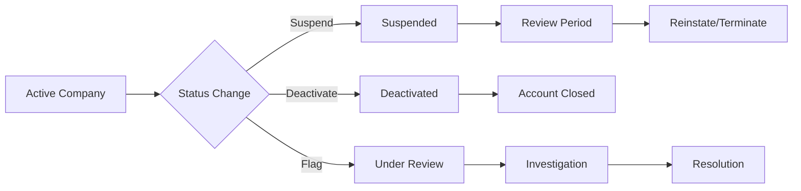

**Status Types:**
- **Active**: Full platform access
- **Suspended**: Temporary restriction with reason
- **Under Review**: Investigation in progress
- **Deactivated**: Account closed, data retained
- **Banned**: Permanent removal from platform

**Suspension Reasons:**
- Policy violations
- Payment disputes
- Quality issues
- Fraudulent activity
- Terms of service breach

### 2. Financial Management

#### 2.1 Revenue Monitoring
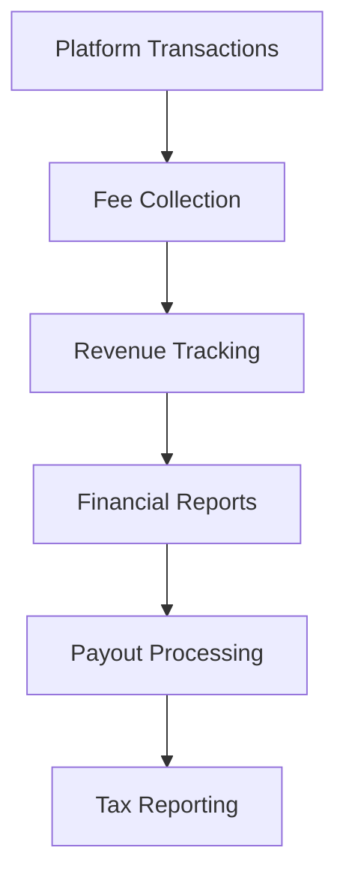

**Revenue Streams:**
- **Platform Fees**: 15% of all transactions
- **Premium Features**: Enhanced listings, priority matching
- **Subscription Plans**: Monthly/annual company subscriptions
- **Transaction Fees**: Payment processing fees

**Financial Dashboards:**
- Real-time revenue tracking
- Monthly/quarterly reports
- Fee collection analytics
- Payout schedules
- Tax documentation

#### 2.2 Payment Dispute Resolution
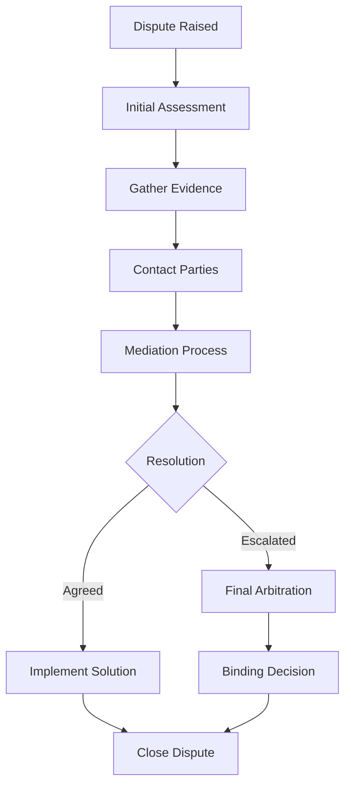

**Dispute Types:**
- **Payment Issues**: Non-payment, partial payment
- **Quality Disputes**: Deliverable quality concerns
- **Scope Creep**: Work beyond original agreement
- **Timeline Disputes**: Deadline disagreements
- **Contract Violations**: Terms not followed

**Resolution Tools:**
- Evidence collection system
- Communication mediation
- Payment hold/release controls
- Refund processing
- Account restrictions

### 3. Engagement Oversight

#### 3.1 Engagement Monitoring
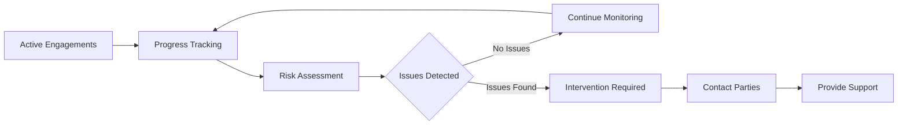

**Monitoring Metrics:**
- **Progress Indicators**: Milestone completion rates
- **Communication Health**: Message frequency and tone
- **Payment Status**: On-time payment rates
- **Quality Scores**: Client satisfaction ratings
- **Timeline Adherence**: Project schedule compliance

**Risk Indicators:**
- Extended periods without progress updates
- Negative communication patterns
- Payment delays or disputes
- Multiple revision requests
- Timeline slippages

#### 3.2 Quality Assurance
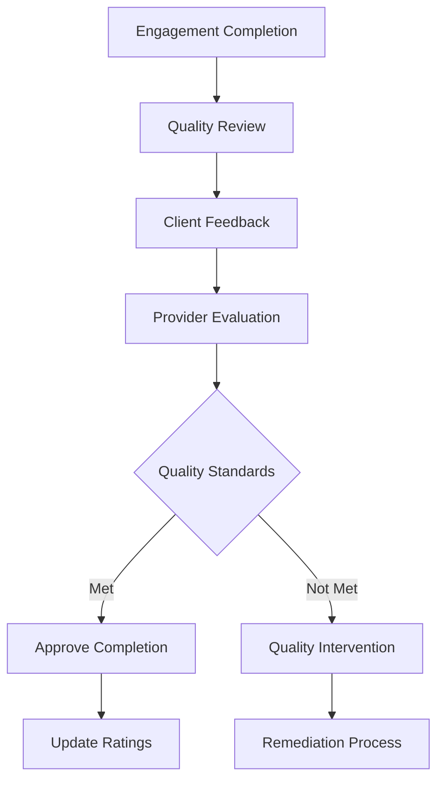

**Quality Metrics:**
- Client satisfaction scores
- Deliverable quality ratings
- Timeline adherence
- Communication effectiveness
- Overall engagement success

### 4. Platform Health & Security

#### 4.1 System Monitoring

| Metric | Value | Status |
|--------|-------|--------|
| **API Response Time** | 245ms | avg last 24h |
| **Error Rate** | 0.12% | -0.03% vs yesterday |
| **Database Performance** | 98.7% | query success rate |
| **Active Connections** | 1,847 | current users |

**Monitoring Areas:**
- **API Performance**: Response times, error rates
- **Database Health**: Query performance, connection pools
- **Security**: Failed login attempts, suspicious activity
- **Integration Status**: Third-party service health
- **User Experience**: Page load times, error reports

#### 4.2 Security Management
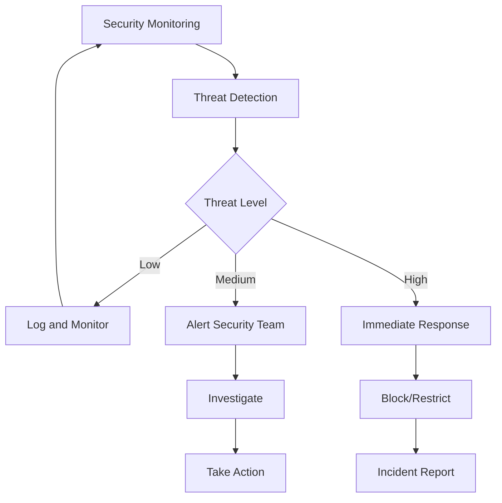

**Security Features:**
- **Authentication Monitoring**: Failed login tracking
- **Fraud Detection**: Suspicious transaction patterns
- **Data Protection**: Encryption and access controls
- **Compliance Monitoring**: GDPR, SOC 2 adherence
- **Incident Response**: Automated threat response

### 5. User Support & Communication

#### 5.1 Support Ticket Management
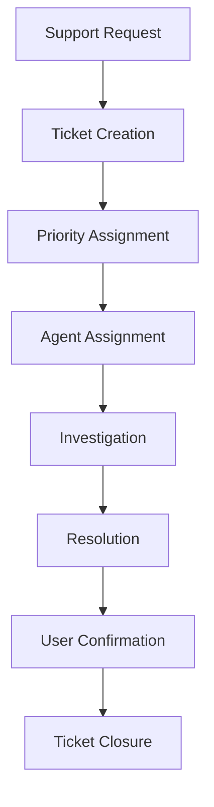

**Support Categories:**
- **Technical Issues**: Platform bugs, integration problems
- **Account Management**: Profile updates, verification issues
- **Payment Support**: Transaction problems, billing questions
- **Engagement Disputes**: Mediation and resolution
- **General Inquiries**: Platform features, policy questions

**Priority Levels:**
- **Critical**: Platform outages, security breaches
- **High**: Payment issues, engagement disputes
- **Medium**: Feature requests, account questions
- **Low**: General inquiries, documentation requests

#### 5.2 Communication Management
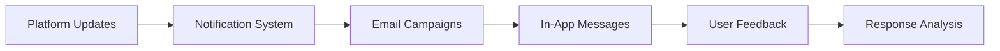

**Communication Types:**
- **System Updates**: Feature releases, maintenance notices
- **Policy Changes**: Terms of service updates
- **Educational Content**: Best practices, tutorials
- **Marketing Messages**: New features, success stories
- **Emergency Notices**: Security alerts, urgent updates

### 6. Analytics & Reporting

#### 6.1 Business Intelligence Dashboard
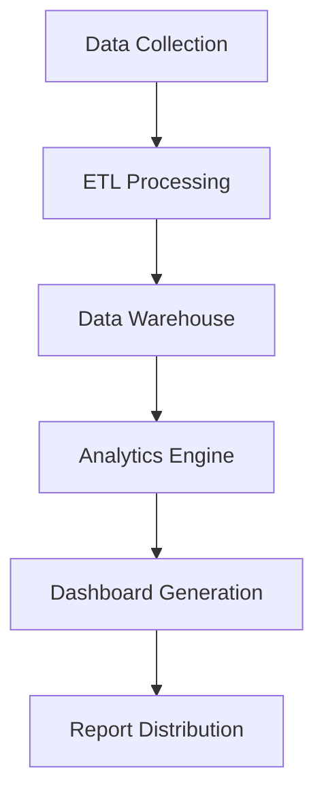

**Key Reports:**
- **Growth Metrics**: User acquisition, retention rates
- **Financial Performance**: Revenue, profit margins
- **Engagement Analytics**: Success rates, completion times
- **User Behavior**: Feature usage, engagement patterns
- **Market Insights**: Industry trends, competitive analysis

#### 6.2 Custom Reporting
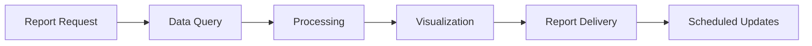

**Report Types:**
- **Executive Summaries**: High-level KPIs and trends
- **Operational Reports**: Daily/weekly performance metrics
- **Financial Reports**: Revenue, costs, profitability
- **Compliance Reports**: Regulatory requirements
- **Custom Analysis**: Ad-hoc business questions

### 7. Platform Configuration

#### 7.1 Feature Management
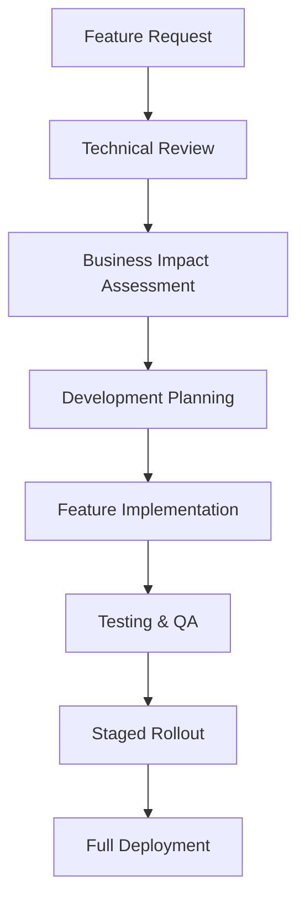

**Configuration Areas:**
- **Matching Algorithm**: Scoring weights, criteria
- **Payment Settings**: Fee structures, processing rules
- **User Permissions**: Role definitions, access controls
- **Integration Settings**: API configurations, webhooks
- **Content Management**: Platform messaging, help content

#### 7.2 A/B Testing Management
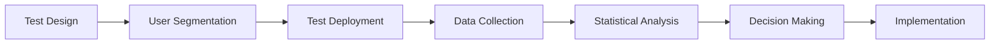

**Testing Areas:**
- **UI/UX Changes**: Interface improvements
- **Algorithm Tuning**: Matching optimization
- **Pricing Models**: Fee structure testing
- **Communication**: Message effectiveness
- **Onboarding**: User experience optimization

### 8. Compliance & Legal

#### 8.1 Regulatory Compliance
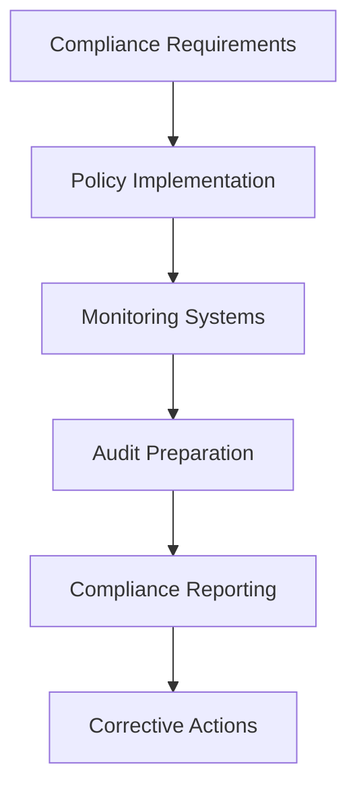

**Compliance Areas:**
- **Data Privacy**: GDPR, CCPA compliance
- **Financial Regulations**: AML, KYC requirements
- **Employment Law**: Contractor vs. employee classification
- **International Trade**: Cross-border transaction rules
- **Industry Standards**: SOC 2, ISO certifications

#### 8.2 Legal Document Management
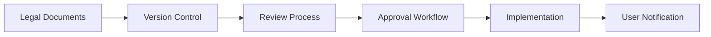

**Document Types:**
- **Terms of Service**: Platform usage rules
- **Privacy Policy**: Data handling practices
- **Contract Templates**: MSA and SOW templates
- **Compliance Policies**: Internal procedures
- **User Agreements**: Service-specific terms

### 9. Emergency Procedures

#### 9.1 Incident Response
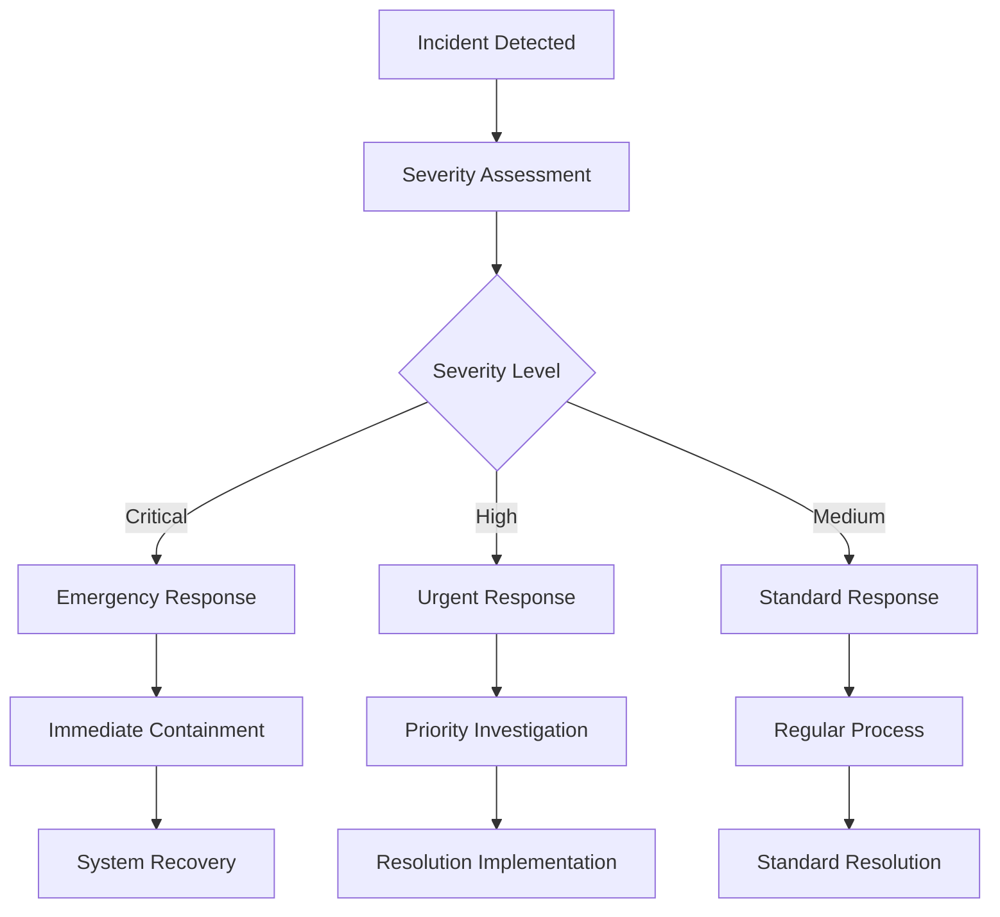

**Incident Types:**
- **Security Breaches**: Data compromises, unauthorized access
- **System Outages**: Platform unavailability
- **Payment Failures**: Transaction processing issues
- **Data Loss**: Database corruption, backup failures
- **Legal Issues**: Regulatory violations, lawsuits

#### 9.2 Business Continuity
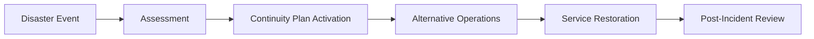

**Continuity Elements:**
- **Backup Systems**: Redundant infrastructure
- **Data Recovery**: Backup and restore procedures
- **Communication Plans**: User and stakeholder notification
- **Alternative Workflows**: Manual processes if needed
- **Recovery Procedures**: System restoration steps

## Admin User Interface

### Dashboard Components
- **Executive Summary**: Key metrics and trends
- **Alert Center**: Critical notifications and warnings
- **Quick Actions**: Common administrative tasks
- **System Status**: Real-time health indicators
- **Recent Activity**: Latest platform events

### Navigation Structure
```
Admin Portal
├── Dashboard
├── Companies
│   ├── All Companies
│   ├── Verification Queue
│   ├── Suspended Accounts
│   └── Company Analytics
├── Engagements
│   ├── Active Engagements
│   ├── Disputes
│   ├── Quality Reviews
│   └── Completion Reports
├── Financial
│   ├── Revenue Dashboard
│   ├── Payment Processing
│   ├── Dispute Resolution
│   └── Financial Reports
├── System
│   ├── Health Monitoring
│   ├── Security Center
│   ├── Integration Status
│   └── Configuration
├── Support
│   ├── Ticket Management
│   ├── User Communication
│   ├── Knowledge Base
│   └── Feedback Analysis
└── Reports
    ├── Business Intelligence
    ├── Custom Reports
    ├── Compliance Reports
    └── Export Tools
```

### Permission Levels
- **Super Admin**: Full system access and configuration
- **Operations Admin**: Day-to-day platform management
- **Financial Admin**: Payment and financial oversight
- **Support Admin**: User support and communication
- **Read-Only Admin**: Reporting and analytics access

## Automation & Workflows

### Automated Processes
- **Company Verification**: Automated checks for standard criteria
- **Payment Processing**: Scheduled payment releases and fee collection
- **Notification Systems**: Automated user communications
- **Report Generation**: Scheduled business reports
- **System Monitoring**: Automated health checks and alerts

### Workflow Triggers
- **Time-based**: Scheduled tasks and reports
- **Event-based**: User actions, system events
- **Threshold-based**: Metric-driven alerts
- **Manual**: Admin-initiated processes
- **API-triggered**: External system integrations
