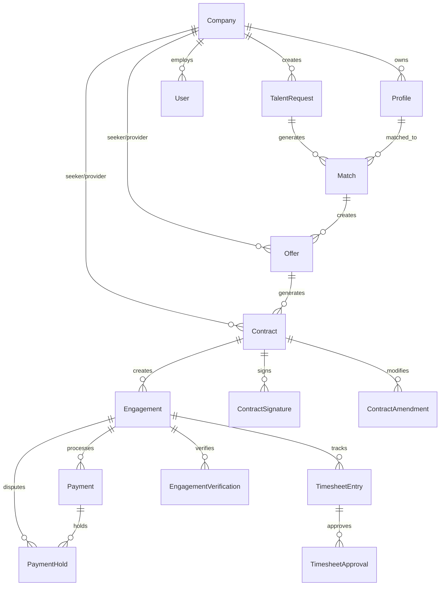

# Database Models & Schema

## Overview
This document details all database models, relationships, and schema design for Talent Brew, a B2B talent marketplace connecting companies with benched professionals to organisations seeking specialised skills.

## Entity Relationship Diagram



## Core Models

### Company
Primary entity representing businesses on the platform.

```prisma
model Company {
  id                String      @id @default(cuid())
  name              String
  domain            String      @unique
  industry          String?
  size              CompanySize?
  description       String?
  website           String?
  logoUrl           String?
  address           String?
  contactEmail      String?
  contactPhone      String?
  verified          Boolean     @default(false)
  verifiedAt        DateTime?
  stripeAccountId   String?     @unique
  stripeOnboarded   Boolean     @default(false)
  status            CompanyStatus @default(ACTIVE)
  createdAt         DateTime    @default(now())
  updatedAt         DateTime    @updatedAt
  
  // Relationships
  users             User[]
  talentRequests    TalentRequest[]
  profiles          Profile[]
  seekerOffers      Offer[]     @relation("SeekerOffers")
  providerOffers    Offer[]     @relation("ProviderOffers")
  seekerContracts   Contract[]  @relation("SeekerContracts")
  providerContracts Contract[]  @relation("ProviderContracts")
  
  @@map("companies")
}

enum CompanySize {
  STARTUP
  SMALL
  MEDIUM
  LARGE
  ENTERPRISE
}

enum CompanyStatus {
  ACTIVE
  SUSPENDED
  PENDING_VERIFICATION
  DEACTIVATED
}
```

### User
Individual users within companies.

```prisma
model User {
  id          String   @id @default(cuid())
  email       String   @unique
  name        String
  role        UserRole @default(USER)
  companyId   String
  avatar      String?
  lastLoginAt DateTime?
  isActive    Boolean  @default(true)
  createdAt   DateTime @default(now())
  updatedAt   DateTime @updatedAt
  
  // Relationships
  company     Company  @relation(fields: [companyId], references: [id])
  
  @@map("users")
}

enum UserRole {
  ADMIN
  USER
  VIEWER
}
```

### TalentRequest
Requests for talent/services posted by seeker companies.

```prisma
model TalentRequest {
  id              String          @id @default(cuid())
  companyId       String
  title           String
  description     String
  industry        String
  projectType     ProjectType
  workStyle       WorkStyle
  experienceLevel ExperienceLevel
  budget          Decimal?
  budgetType      BudgetType      @default(HOURLY)
  currency        String          @default("USD")
  timeline        String?
  startDate       DateTime?
  endDate         DateTime?
  requirements    Json?           // Skills, certifications, etc.
  deliverables    String[]
  status          RequestStatus   @default(ACTIVE)
  priority        Priority        @default(MEDIUM)
  createdAt       DateTime        @default(now())
  updatedAt       DateTime        @updatedAt
  
  // Relationships
  company         Company         @relation(fields: [companyId], references: [id])
  matches         Match[]
  
  @@map("talent_requests")
}

enum ProjectType {
  CONTENT_CREATION
  SOCIAL_MEDIA_MANAGEMENT
  INFLUENCER_CAMPAIGN
  BRAND_PARTNERSHIP
  VIDEO_PRODUCTION
  PHOTOGRAPHY
  COPYWRITING
  STRATEGY_CONSULTING
  EVENT_PROMOTION
  PRODUCT_LAUNCH
}

enum WorkStyle {
  REMOTE
  HYBRID
  ON_SITE
  FLEXIBLE
}

enum ExperienceLevel {
  ENTRY
  INTERMEDIATE
  SENIOR
  EXPERT
}

enum BudgetType {
  HOURLY
  PROJECT
  MONTHLY
  PERFORMANCE
}

enum RequestStatus {
  DRAFT
  ACTIVE
  PAUSED
  COMPLETED
  CANCELLED
}

enum Priority {
  LOW
  MEDIUM
  HIGH
  URGENT
}
```

### Profile
Talent profiles representing service providers.

```prisma
model Profile {
  id              String          @id @default(cuid())
  companyId       String
  name            String
  title           String?
  bio             String?
  skills          String[]
  specialties     String[]
  experience      Json?           // Years of experience, past projects
  portfolio       Json?           // Portfolio items, case studies
  hourlyRate      Decimal?
  projectRate     Decimal?
  availability    String?
  timezone        String?
  languages       String[]
  certifications  String[]
  socialMedia     Json?           // Social media handles and followers
  verified        Boolean         @default(false)
  verifiedAt      DateTime?
  rating          Float?
  reviewCount     Int             @default(0)
  completedProjects Int           @default(0)
  status          ProfileStatus   @default(ACTIVE)
  createdAt       DateTime        @default(now())
  updatedAt       DateTime        @updatedAt
  
  // Relationships
  company         Company         @relation(fields: [companyId], references: [id])
  matches         Match[]
  
  @@map("profiles")
}

enum ProfileStatus {
  ACTIVE
  INACTIVE
  SUSPENDED
  UNDER_REVIEW
}
```

### Match
AI-generated matches between talent requests and profiles.

```prisma
model Match {
  id              String      @id @default(cuid())
  requestId       String
  profileId       String
  score           Float       // 0.0 to 1.0 matching score
  factors         Json?       // Detailed scoring factors
  status          MatchStatus @default(PENDING)
  viewedBySeeker  Boolean     @default(false)
  viewedByProvider Boolean    @default(false)
  seekerInterest  Boolean?    // null = not responded, true = interested, false = not interested
  providerInterest Boolean?
  matchedAt       DateTime    @default(now())
  respondedAt     DateTime?
  
  // Relationships
  request         TalentRequest @relation(fields: [requestId], references: [id])
  profile         Profile       @relation(fields: [profileId], references: [id])
  offers          Offer[]
  
  @@unique([requestId, profileId])
  @@map("matches")
}

enum MatchStatus {
  PENDING
  VIEWED
  INTERESTED
  NOT_INTERESTED
  OFFER_MADE
  CLOSED
}
```

### Offer
Financial offers made between matched parties.

```prisma
model Offer {
  id                String      @id @default(cuid())
  matchId           String
  seekerCompanyId   String
  providerCompanyId String
  rate              Decimal
  rateType          RateType    @default(HOURLY)
  currency          String      @default("USD")
  startDate         DateTime
  endDate           DateTime?
  durationWeeks     Int?
  estimatedHours    Int?
  totalAmount       Decimal
  platformFee       Decimal     // 15% of total amount
  providerAmount    Decimal     // Total amount minus platform fee
  terms             String?
  deliverables      String[]
  milestones        Json?       // Milestone definitions with amounts
  paymentTerms      String?
  status            OfferStatus @default(PENDING)
  expiresAt         DateTime?
  createdAt         DateTime    @default(now())
  updatedAt         DateTime    @updatedAt
  acceptedAt        DateTime?
  rejectedAt        DateTime?
  rejectionReason   String?
  
  // Counter offer tracking
  originalOfferId   String?     // Reference to original offer if this is a counter
  counterOffers     Offer[]     @relation("OfferCounters")
  originalOffer     Offer?      @relation("OfferCounters", fields: [originalOfferId], references: [id])
  
  // Relationships
  match             Match       @relation(fields: [matchId], references: [id])
  seekerCompany     Company     @relation("SeekerOffers", fields: [seekerCompanyId], references: [id])
  providerCompany   Company     @relation("ProviderOffers", fields: [providerCompanyId], references: [id])
  contracts         Contract[]
  
  @@map("offers")
}

enum RateType {
  HOURLY
  DAILY
  WEEKLY
  MONTHLY
  PROJECT
}

enum OfferStatus {
  PENDING
  ACCEPTED
  REJECTED
  COUNTERED
  EXPIRED
  WITHDRAWN
}
```

### Contract
Legal contracts generated from accepted offers.

```prisma
model Contract {
  id                String            @id @default(cuid())
  offerId           String
  seekerCompanyId   String
  providerCompanyId String
  contractNumber    String            @unique // Human-readable contract number
  msaContent        String            // Master Service Agreement content
  sowContent        String            // Statement of Work content
  combinedDocument  String?           // Combined PDF content (base64)
  status            ContractStatus    @default(DRAFT)
  version           String            @default("1.0")
  
  // E-signature integration
  envelopeId        String?           @unique // DocuSign envelope ID
  sentForSignatureAt DateTime?
  
  // Signature tracking
  seekerSigned      Boolean           @default(false)
  seekerSignedAt    DateTime?
  seekerSignedBy    String?
  providerSigned    Boolean           @default(false)
  providerSignedAt  DateTime?
  providerSignedBy  String?
  fullyExecutedAt   DateTime?
  
  // Contract lifecycle
  effectiveDate     DateTime?
  expirationDate    DateTime?
  terminatedAt      DateTime?
  terminationReason String?
  
  createdAt         DateTime          @default(now())
  updatedAt         DateTime          @updatedAt
  
  // Relationships
  offer             Offer             @relation(fields: [offerId], references: [id])
  seekerCompany     Company           @relation("SeekerContracts", fields: [seekerCompanyId], references: [id])
  providerCompany   Company           @relation("ProviderContracts", fields: [providerCompanyId], references: [id])
  signatures        ContractSignature[]
  amendments        ContractAmendment[]
  engagements       Engagement[]
  
  @@map("contracts")
}

enum ContractStatus {
  DRAFT
  SENT_FOR_SIGNATURE
  PARTIALLY_SIGNED
  FULLY_SIGNED
  EXECUTED
  TERMINATED
  CANCELLED
}
```

### ContractSignature
Individual signature records for audit trail.

```prisma
model ContractSignature {
  id          String   @id @default(cuid())
  contractId  String
  signerType  SignerType
  signerName  String
  signerEmail String
  signedAt    DateTime @default(now())
  ipAddress   String?
  userAgent   String?
  
  // Relationships
  contract    Contract @relation(fields: [contractId], references: [id])
  
  @@map("contract_signatures")
}

enum SignerType {
  SEEKER
  PROVIDER
}
```

### ContractAmendment
Contract modifications and amendments.

```prisma
model ContractAmendment {
  id          String   @id @default(cuid())
  contractId  String
  amendmentNumber Int
  reason      String
  changes     Json     // Detailed changes made
  requestedBy String
  requestedAt DateTime @default(now())
  approvedBy  String?
  approvedAt  DateTime?
  status      AmendmentStatus @default(PENDING)
  
  // Relationships
  contract    Contract @relation(fields: [contractId], references: [id])
  
  @@unique([contractId, amendmentNumber])
  @@map("contract_amendments")
}

enum AmendmentStatus {
  PENDING
  APPROVED
  REJECTED
}
```

### Engagement
Active work engagements from executed contracts.

```prisma
model Engagement {
  id              String            @id @default(cuid())
  contractId      String
  status          EngagementStatus  @default(ACTIVE)
  startDate       DateTime
  endDate         DateTime?
  actualEndDate   DateTime?
  completedAt     DateTime?
  terminatedAt    DateTime?
  terminationReason String?
  disputedAt      DateTime?
  disputeReason   String?
  
  // Progress tracking
  progressPercent Int               @default(0)
  currentPhase    String?
  nextMilestone   DateTime?
  
  createdAt       DateTime          @default(now())
  updatedAt       DateTime          @updatedAt
  
  // Relationships
  contract        Contract          @relation(fields: [contractId], references: [id])
  payments        Payment[]
  timesheets      TimesheetEntry[]
  verifications   EngagementVerification[]
  holds           PaymentHold[]
  
  @@map("engagements")
}

enum EngagementStatus {
  ACTIVE
  COMPLETED
  TERMINATED
  DISPUTED
  ON_HOLD
}
```

### EngagementVerification
Completion verification records.

```prisma
model EngagementVerification {
  id            String              @id @default(cuid())
  engagementId  String
  verifiedBy    String
  verifiedAt    DateTime            @default(now())
  deliverables  Json                // List of completed deliverables
  notes         String?
  status        VerificationStatus  @default(PENDING)
  approvedBy    String?
  approvedAt    DateTime?
  rejectedBy    String?
  rejectedAt    DateTime?
  rejectionReason String?
  
  // Relationships
  engagement    Engagement          @relation(fields: [engagementId], references: [id])
  
  @@map("engagement_verifications")
}

enum VerificationStatus {
  PENDING
  APPROVED
  REJECTED
  UNDER_REVIEW
}
```

### Payment
Payment transactions and releases.

```prisma
model Payment {
  id              String        @id @default(cuid())
  engagementId    String
  amount          Decimal
  currency        String        @default("USD")
  type            PaymentType
  status          PaymentStatus @default(PENDING)
  reason          String?       // completion, milestone, partial, etc.
  
  // Payment processing
  stripePaymentId String?       @unique
  transactionId   String?
  processedAt     DateTime?
  completedAt     DateTime?
  failedAt        DateTime?
  failureReason   String?
  
  // Verification data
  verificationData Json?
  milestoneId     String?
  
  createdAt       DateTime      @default(now())
  updatedAt       DateTime      @updatedAt
  
  // Relationships
  engagement      Engagement    @relation(fields: [engagementId], references: [id])
  holds           PaymentHold[]
  
  @@map("payments")
}

enum PaymentType {
  ESCROW
  RELEASE
  REFUND
  ADJUSTMENT
}

enum PaymentStatus {
  PENDING
  PROCESSING
  COMPLETED
  FAILED
  CANCELLED
  HELD
}
```

### PaymentHold
Payment holds for disputes or quality issues.

```prisma
model PaymentHold {
  id            String      @id @default(cuid())
  engagementId  String
  paymentId     String?
  amount        Decimal
  currency      String      @default("USD")
  reason        HoldReason
  holdUntil     DateTime?
  notes         String?
  status        HoldStatus  @default(ACTIVE)
  
  // Resolution
  resolvedAt    DateTime?
  resolvedBy    String?
  resolution    String?
  
  createdAt     DateTime    @default(now())
  updatedAt     DateTime    @updatedAt
  
  // Relationships
  engagement    Engagement  @relation(fields: [engagementId], references: [id])
  payment       Payment?    @relation(fields: [paymentId], references: [id])
  
  @@map("payment_holds")
}

enum HoldReason {
  DISPUTE
  QUALITY_ISSUE
  BREACH_OF_CONTRACT
  INVESTIGATION
  COMPLIANCE
}

enum HoldStatus {
  ACTIVE
  RESOLVED
  CANCELLED
}
```

### TimesheetEntry
Time tracking for hourly engagements.

```prisma
model TimesheetEntry {
  id            String            @id @default(cuid())
  engagementId  String
  date          DateTime
  startTime     DateTime
  endTime       DateTime
  hoursWorked   Decimal
  description   String
  taskCategory  String?
  billable      Boolean           @default(true)
  status        TimesheetStatus   @default(DRAFT)
  
  // Approval workflow
  submittedAt   DateTime?
  approvedAt    DateTime?
  approvedBy    String?
  rejectedAt    DateTime?
  rejectionReason String?
  
  createdAt     DateTime          @default(now())
  updatedAt     DateTime          @updatedAt
  
  // Relationships
  engagement    Engagement        @relation(fields: [engagementId], references: [id])
  
  @@map("timesheet_entries")
}

enum TimesheetStatus {
  DRAFT
  SUBMITTED
  APPROVED
  REJECTED
}
```

## Indexes and Performance

### Key Indexes
```sql
-- Company lookups
CREATE INDEX idx_companies_domain ON companies(domain);
CREATE INDEX idx_companies_verified ON companies(verified);

-- Talent request filtering
CREATE INDEX idx_talent_requests_status ON talent_requests(status);
CREATE INDEX idx_talent_requests_company ON talent_requests(company_id);
CREATE INDEX idx_talent_requests_project_type ON talent_requests(project_type);

-- Match queries
CREATE INDEX idx_matches_request ON matches(request_id);
CREATE INDEX idx_matches_profile ON matches(profile_id);
CREATE INDEX idx_matches_score ON matches(score DESC);
CREATE INDEX idx_matches_status ON matches(status);

-- Offer management
CREATE INDEX idx_offers_match ON offers(match_id);
CREATE INDEX idx_offers_status ON offers(status);
CREATE INDEX idx_offers_companies ON offers(seeker_company_id, provider_company_id);

-- Contract tracking
CREATE INDEX idx_contracts_status ON contracts(status);
CREATE INDEX idx_contracts_envelope ON contracts(envelope_id);

-- Engagement monitoring
CREATE INDEX idx_engagements_status ON engagements(status);
CREATE INDEX idx_engagements_dates ON engagements(start_date, end_date);

-- Payment processing
CREATE INDEX idx_payments_status ON payments(status);
CREATE INDEX idx_payments_engagement ON payments(engagement_id);

-- Timesheet queries
CREATE INDEX idx_timesheets_engagement ON timesheet_entries(engagement_id);
CREATE INDEX idx_timesheets_date ON timesheet_entries(date);
CREATE INDEX idx_timesheets_status ON timesheet_entries(status);
```

## Data Constraints

### Business Rules
1. **Company Domain Uniqueness**: Each company must have a unique verified domain
2. **Offer Expiration**: Offers must have expiration dates and auto-expire
3. **Contract Signatures**: Both parties must sign before engagement creation
4. **Payment Validation**: Total payments cannot exceed contract amount
5. **Timesheet Validation**: Time entries cannot overlap for same engagement
6. **Rate Consistency**: Offer rates must match contract terms

### Data Integrity
- All monetary values use `Decimal` type for precision
- Timestamps include timezone information
- JSON fields have validation schemas
- Foreign key constraints maintain referential integrity
- Soft deletes preserve audit trails
