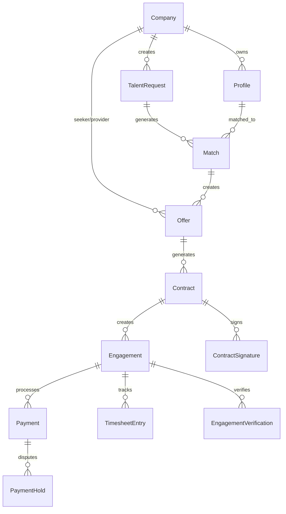

# BenchWarmers - System Overview

## Table of Contents
1. [System Architecture](#system-architecture)
2. [Database Models](#database-models)
3. [Core Workflows](#core-workflows)
4. [User Flows](#user-flows)
5. [Admin Workflows](#admin-workflows)
6. [API Endpoints](#api-endpoints)
7. [Integration Points](#integration-points)
8. [Security & Authentication](#security--authentication)

## System Architecture

### Technology Stack
- **Framework**: Next.js 14 with TypeScript
- **Database**: PostgreSQL with Prisma ORM
- **Authentication**: NextAuth.js
- **Payments**: Stripe (escrow and releases)
- **E-signatures**: DocuSign integration
- **Logging**: Structured logging with correlation IDs
- **Validation**: Zod schemas

### Core Components
```
┌─────────────────┐    ┌─────────────────┐    ┌─────────────────┐
│   Frontend UI   │    │   API Routes    │    │   Core Logic    │
│                 │    │                 │    │                 │
│ - Company Dash  │◄──►│ - Offers        │◄──►│ - Match Engine  │
│ - Profile Mgmt  │    │ - Contracts     │    │ - Payment Mgr   │
│ - Engagement    │    │ - Engagements   │    │ - Contract Gen  │
│ - Timesheets    │    │ - Timesheets    │    │ - Timesheet Mgr │
└─────────────────┘    └─────────────────┘    └─────────────────┘
         │                       │                       │
         └───────────────────────┼───────────────────────┘
                                 │
┌─────────────────┐    ┌─────────────────┐    ┌─────────────────┐
│   External APIs │    │    Database     │    │   File Storage  │
│                 │    │                 │    │                 │
│ - DocuSign      │    │ - PostgreSQL    │    │ - Contract PDFs │
│ - Stripe        │    │ - Prisma ORM    │    │ - Profile Media │
│ - SendGrid      │    │ - Migrations    │    │ - Deliverables  │
└─────────────────┘    └─────────────────┘    └─────────────────┘
```

## Database Models

### Core Entity Relationships


### Key Models

#### Company
```typescript
model Company {
  id                String   @id @default(cuid())
  name              String
  domain            String   @unique
  industry          String?
  size              CompanySize?
  description       String?
  website           String?
  logoUrl           String?
  verified          Boolean  @default(false)
  stripeAccountId   String?
  
  // Relationships
  talentRequests    TalentRequest[]
  profiles          Profile[]
  seekerOffers      Offer[]     @relation("SeekerOffers")
  providerOffers    Offer[]     @relation("ProviderOffers")
  seekerContracts   Contract[]  @relation("SeekerContracts")
  providerContracts Contract[]  @relation("ProviderContracts")
}
```

#### TalentRequest
```typescript
model TalentRequest {
  id              String   @id @default(cuid())
  companyId       String
  title           String
  description     String
  industry        String
  projectType     ProjectType
  workStyle       WorkStyle
  experienceLevel ExperienceLevel
  budget          Decimal?
  currency        String   @default("USD")
  timeline        String?
  requirements    Json?
  status          RequestStatus @default(ACTIVE)
  
  // Relationships
  company         Company  @relation(fields: [companyId], references: [id])
  matches         Match[]
}
```

#### Profile
```typescript
model Profile {
  id              String   @id @default(cuid())
  companyId       String
  name            String
  title           String?
  bio             String?
  skills          String[]
  experience      Json?
  portfolio       Json?
  hourlyRate      Decimal?
  availability    String?
  verified        Boolean  @default(false)
  
  // Relationships
  company         Company  @relation(fields: [companyId], references: [id])
  matches         Match[]
}
```

#### Match
```typescript
model Match {
  id              String      @id @default(cuid())
  requestId       String
  profileId       String
  score           Float
  status          MatchStatus @default(PENDING)
  matchedAt       DateTime    @default(now())
  
  // Relationships
  request         TalentRequest @relation(fields: [requestId], references: [id])
  profile         Profile       @relation(fields: [profileId], references: [id])
  offers          Offer[]
}
```

#### Offer
```typescript
model Offer {
  id                String      @id @default(cuid())
  matchId           String
  seekerCompanyId   String
  providerCompanyId String
  rate              Decimal
  currency          String      @default("USD")
  startDate         DateTime
  durationWeeks     Int
  totalAmount       Decimal
  platformFee       Decimal
  providerAmount    Decimal
  terms             String?
  status            OfferStatus @default(PENDING)
  
  // Relationships
  match             Match    @relation(fields: [matchId], references: [id])
  seekerCompany     Company  @relation("SeekerOffers", fields: [seekerCompanyId], references: [id])
  providerCompany   Company  @relation("ProviderOffers", fields: [providerCompanyId], references: [id])
  contracts         Contract[]
}
```

#### Contract
```typescript
model Contract {
  id                String         @id @default(cuid())
  offerId           String
  seekerCompanyId   String
  providerCompanyId String
  msaContent        String
  sowContent        String
  status            ContractStatus @default(DRAFT)
  version           String         @default("1.0")
  envelopeId        String?        // DocuSign envelope ID
  
  // Relationships
  offer             Offer      @relation(fields: [offerId], references: [id])
  seekerCompany     Company    @relation("SeekerContracts", fields: [seekerCompanyId], references: [id])
  providerCompany   Company    @relation("ProviderContracts", fields: [providerCompanyId], references: [id])
  signatures        ContractSignature[]
  engagements       Engagement[]
}
```

#### Engagement
```typescript
model Engagement {
  id              String            @id @default(cuid())
  contractId      String
  status          EngagementStatus  @default(ACTIVE)
  startDate       DateTime
  endDate         DateTime?
  completedAt     DateTime?
  
  // Relationships
  contract        Contract @relation(fields: [contractId], references: [id])
  payments        Payment[]
  timesheets      TimesheetEntry[]
  verifications   EngagementVerification[]
}
```

## Core Workflows

### 1. Talent Matching Flow
```
Company Creates Request → Matching Algorithm Runs → Matches Generated → 
Notifications Sent → Companies Review Matches → Interest Expressed
```

### 2. Offer Management Flow
```
Match Approved → Offer Created → Offer Sent → Provider Response:
├── Accept → Contract Generation
├── Decline → Match Closed
└── Counter → Negotiation Loop
```

### 3. Contract Execution Flow
```
Offer Accepted → Contract Generated → Sent for E-signature → 
Both Parties Sign → Engagement Created → Work Begins
```

### 4. Engagement Lifecycle
```
Active Engagement → Work Progress → Milestone Completion → 
Payment Release → Final Completion → Engagement Closed
```

### 5. Payment Flow
```
Funds Escrowed → Milestone Reached → Verification → 
Payment Released → Platform Fee Deducted
```

## User Flows

### Seeker Company Flow
1. **Onboarding**
   - Company registration and verification
   - Profile setup and domain verification
   - Payment method setup (Stripe)

2. **Talent Request Creation**
   - Define project requirements
   - Set budget and timeline
   - Specify skills and experience level
   - Submit for matching

3. **Match Review**
   - Review generated matches
   - View provider profiles and portfolios
   - Express interest or pass on matches

4. **Offer Management**
   - Create offers for interested matches
   - Negotiate terms and rates
   - Approve final offer terms

5. **Contract & Engagement**
   - Review and sign contracts
   - Monitor engagement progress
   - Approve deliverables and milestones
   - Release payments

### Provider Company Flow
1. **Onboarding**
   - Company registration
   - Profile creation with portfolio
   - Skills and experience documentation
   - Rate and availability setup

2. **Match Notifications**
   - Receive match notifications
   - Review project details
   - Express interest in opportunities

3. **Offer Response**
   - Review incoming offers
   - Accept, decline, or counter offers
   - Negotiate terms and conditions

4. **Contract & Work**
   - Sign contracts electronically
   - Begin work on engagement
   - Submit deliverables and timesheets
   - Track payment releases

## Admin Workflows

### Platform Administration
1. **Company Management**
   - Review and approve company registrations
   - Verify domain ownership
   - Manage company profiles and status

2. **Match Quality Control**
   - Monitor matching algorithm performance
   - Adjust matching parameters
   - Handle match disputes

3. **Financial Management**
   - Monitor platform fees and revenue
   - Handle payment disputes
   - Manage escrow accounts
   - Process refunds and adjustments

4. **Contract Oversight**
   - Monitor contract completion rates
   - Handle contract disputes
   - Manage e-signature integration

5. **System Monitoring**
   - Track system performance metrics
   - Monitor API usage and errors
   - Manage integrations (DocuSign, Stripe)

### Support Workflows
1. **Dispute Resolution**
   - Investigate payment disputes
   - Mediate contract disagreements
   - Escalate complex issues

2. **Quality Assurance**
   - Review engagement completions
   - Monitor user feedback
   - Ensure platform standards

## API Endpoints

### Authentication & Companies
- `POST /api/auth/signin` - User authentication
- `GET /api/companies` - List companies
- `POST /api/companies` - Create company
- `GET /api/companies/[id]` - Get company details
- `PATCH /api/companies/[id]` - Update company

### Talent Requests & Matching
- `GET /api/requests` - List talent requests
- `POST /api/requests` - Create talent request
- `GET /api/requests/[id]` - Get request details
- `GET /api/matches` - List matches
- `POST /api/matches/generate` - Generate matches
- `PATCH /api/matches/[id]` - Update match status

### Offers & Negotiations
- `GET /api/offers` - List offers
- `POST /api/offers` - Create offer
- `GET /api/offers/[id]` - Get offer details
- `PATCH /api/offers/[id]` - Update offer (accept/decline/counter)
- `DELETE /api/offers/[id]` - Cancel offer

### Contracts & E-signatures
- `GET /api/contracts` - List contracts
- `POST /api/contracts` - Generate contract
- `GET /api/contracts/[id]` - Get contract details
- `PATCH /api/contracts/[id]` - Update contract
- `POST /api/contracts/[id]/sign` - Send for e-signature
- `DELETE /api/contracts/[id]` - Cancel contract

### Engagements & Completion
- `GET /api/engagements` - List engagements
- `POST /api/engagements` - Create engagement
- `GET /api/engagements/[id]` - Get engagement details
- `PATCH /api/engagements/[id]` - Update engagement status
- `POST /api/engagements/[id]/complete` - Complete engagement

### Payments & Financial
- `GET /api/payments` - List payments
- `POST /api/payments/release` - Release payment
- `POST /api/payments/hold` - Hold payment
- `GET /api/payments/[id]` - Get payment details

### Timesheets & Tracking
- `GET /api/timesheets` - List timesheet entries
- `POST /api/timesheets` - Create timesheet entry
- `PATCH /api/timesheets/[id]` - Update timesheet
- `POST /api/timesheets/submit` - Submit for approval
- `POST /api/timesheets/approve` - Approve timesheets

## Integration Points

### DocuSign E-signature
- **Purpose**: Contract signing workflow
- **Endpoints**: Send for signature, check status, download signed documents
- **Webhooks**: Real-time signature status updates
- **Configuration**: Requires DocuSign developer account and API keys

### Stripe Payments
- **Purpose**: Payment processing and escrow management
- **Features**: Connect accounts, payment holds, releases, refunds
- **Webhooks**: Payment status updates and dispute notifications
- **Configuration**: Requires Stripe Connect setup

### SendGrid Email
- **Purpose**: Transactional emails and notifications
- **Types**: Match notifications, offer updates, contract reminders
- **Templates**: Dynamic email templates with branding
- **Configuration**: API key and verified sender domains

## Security & Authentication

### Authentication Flow
1. **Company Registration**: Email verification and domain validation
2. **Session Management**: NextAuth.js with JWT tokens
3. **Role-Based Access**: Company admin, users, platform admin
4. **API Security**: Correlation IDs, rate limiting, input validation

### Data Protection
- **Encryption**: All sensitive data encrypted at rest
- **PII Handling**: GDPR compliant data processing
- **Audit Logging**: All actions logged with correlation IDs
- **Access Controls**: Role-based permissions throughout system

### Compliance
- **SOC 2**: Security and availability controls
- **GDPR**: Data privacy and right to deletion
- **Financial**: PCI DSS compliance for payment processing
- **Contracts**: Legal compliance for electronic signatures
