# User Workflows Documentation

## Overview
This document details the complete user workflows for both seeker companies (talent buyers) and provider companies (talent sellers) in BenchWarmers, a B2B talent marketplace connecting companies with benched professionals to organisations seeking specialised skills.

## Seeker Company Workflows

### 1. Company Onboarding & Setup

#### 1.1 Initial Registration
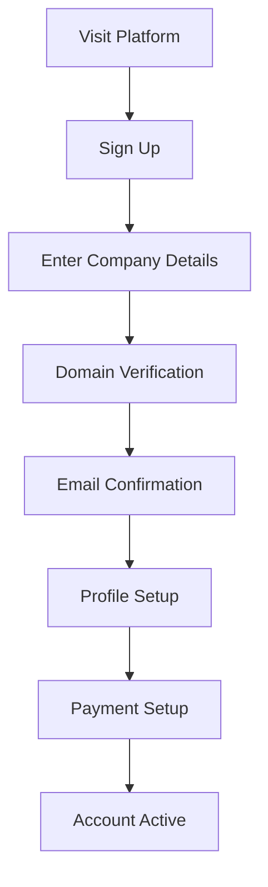

**Steps:**
1. **Sign Up**: Create account with company email
2. **Company Information**: 
   - Company name, industry, size
   - Website URL and description
   - Contact information
3. **Domain Verification**: 
   - DNS verification or email confirmation
   - Ensures company legitimacy
4. **Profile Setup**:
   - Upload company logo
   - Add detailed company description
   - Set company preferences
5. **Payment Setup**:
   - Connect Stripe account for payments
   - Set up billing information
   - Configure payment methods

**UI Components:**
- Multi-step onboarding wizard
- Domain verification modal
- Stripe Connect integration
- Progress indicators

### 1.2 Team Management
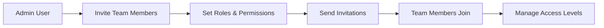

**Roles:**
- **Admin**: Full access, billing, team management
- **User**: Create requests, manage offers, view engagements
- **Viewer**: Read-only access to company data

### 2. Talent Request Creation

#### 2.1 Request Creation Flow
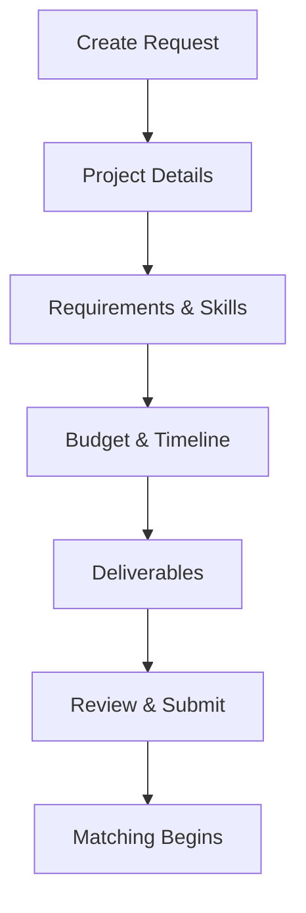

**Step Details:**

**Project Details:**
- Project title and description
- Industry and project type selection
- Work style preferences (remote/hybrid/on-site)
- Experience level requirements

**Requirements & Skills:**
- Required skills and expertise
- Preferred certifications
- Portfolio requirements
- Social media following requirements

**Budget & Timeline:**
- Budget range and type (hourly/project/monthly)
- Project timeline and key dates
- Milestone definitions
- Payment terms preferences

**Deliverables:**
- Specific deliverables expected
- Quality standards
- Review and approval process
- Acceptance criteria

**UI Components:**
- Smart form with conditional fields
- Skill suggestion autocomplete
- Budget calculator
- Timeline picker
- Deliverable builder

### 2.2 Request Management
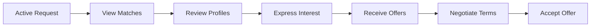

**Dashboard Features:**
- Request status tracking
- Match notifications
- Offer management
- Communication center
- Analytics and insights

### 3. Match Review & Selection

#### 3.1 Match Evaluation Process
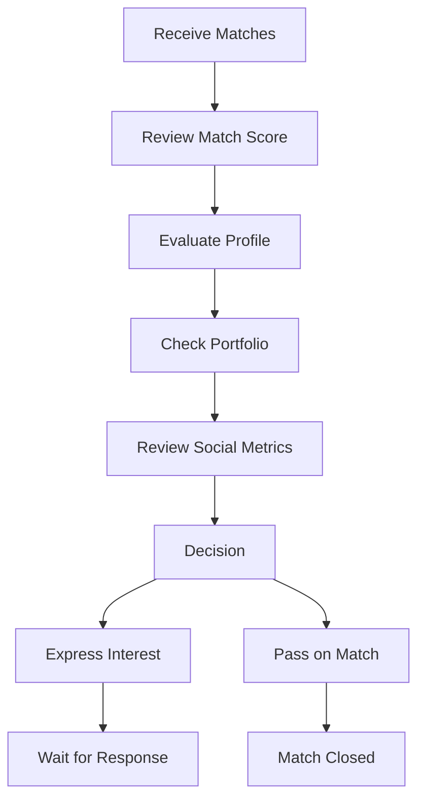

**Evaluation Criteria:**
- **Match Score**: AI-generated compatibility score
- **Experience**: Relevant project history
- **Portfolio**: Quality of previous work
- **Social Metrics**: Follower count, engagement rates
- **Availability**: Timeline alignment
- **Rate Compatibility**: Budget vs. provider rates

**Profile Review Features:**
- Detailed profile view with portfolio
- Social media metrics dashboard
- Client testimonials and reviews
- Availability calendar
- Rate comparison tools

### 4. Offer Management & Negotiation

#### 4.1 Offer Creation
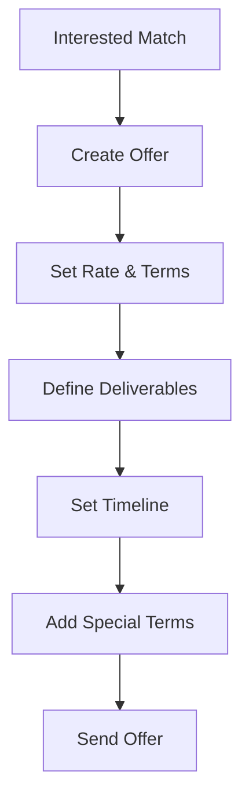

**Offer Components:**
- **Financial Terms**:
  - Hourly/project rate
  - Total project value
  - Payment schedule
  - Platform fee (15%)
- **Timeline**:
  - Start and end dates
  - Milestone deadlines
  - Review periods
- **Deliverables**:
  - Specific outputs expected
  - Quality standards
  - Revision allowances
- **Terms & Conditions**:
  - Usage rights
  - Exclusivity clauses
  - Cancellation terms

#### 4.2 Negotiation Process
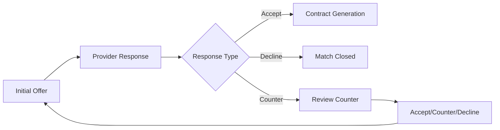

**Negotiation Features:**
- Real-time offer tracking
- Counter-offer management
- Communication thread
- Version history
- Automated notifications

### 5. Contract & Engagement Management

#### 5.1 Contract Execution
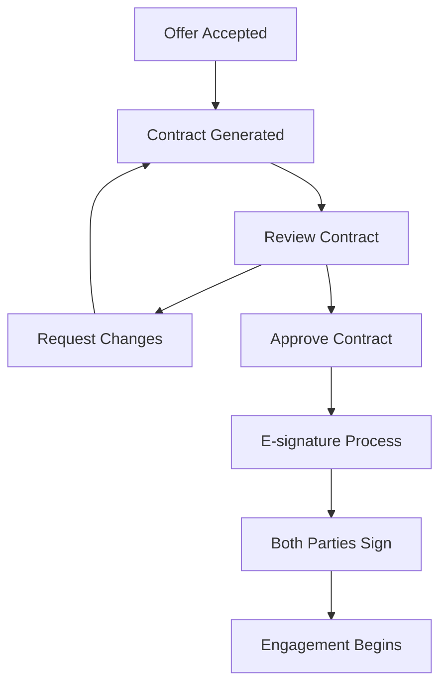

**Contract Features:**
- Auto-generated MSA and SOW
- Customizable terms and clauses
- Legal review workflow
- DocuSign integration
- Version control and amendments

#### 5.2 Engagement Monitoring
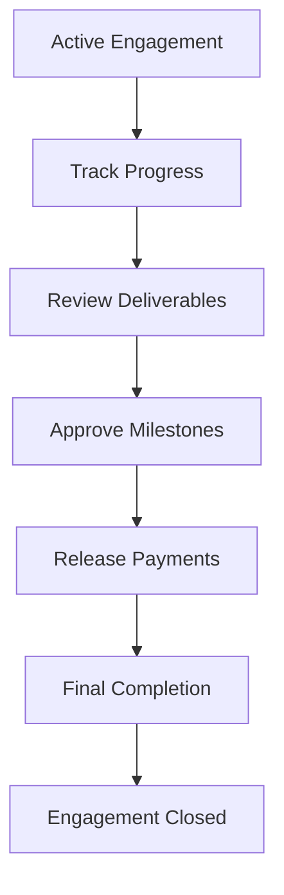

**Monitoring Tools:**
- Progress dashboard
- Milestone tracking
- Deliverable review system
- Communication center
- Payment release controls
- Performance analytics

### 6. Payment & Financial Management

#### 6.1 Payment Flow
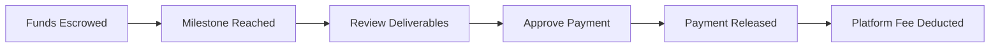

**Financial Features:**
- Escrow account management
- Milestone-based payments
- Automatic fee calculations
- Payment history and reporting
- Invoice generation
- Tax documentation

## Provider Company Workflows

### 1. Company Onboarding & Profile Creation

#### 1.1 Registration & Verification
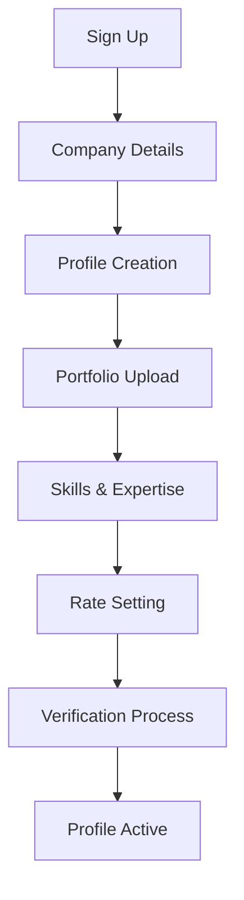

**Profile Components:**
- **Company Information**:
  - Business name and description
  - Industry focus and specialties
  - Team size and structure
  - Contact information
- **Portfolio**:
  - Case studies and examples
  - Client testimonials
  - Performance metrics
  - Media samples
- **Capabilities**:
  - Service offerings
  - Skill categories
  - Experience levels
  - Certifications
- **Pricing**:
  - Hourly rates by service
  - Project-based pricing
  - Package offerings
  - Minimum engagement sizes

#### 1.2 Social Media Integration
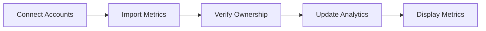

**Supported Platforms:**
- Instagram, TikTok, YouTube
- LinkedIn, Twitter/X, Facebook
- Industry-specific platforms
- Blog and website analytics

### 2. Match Discovery & Response

#### 2.1 Match Notifications
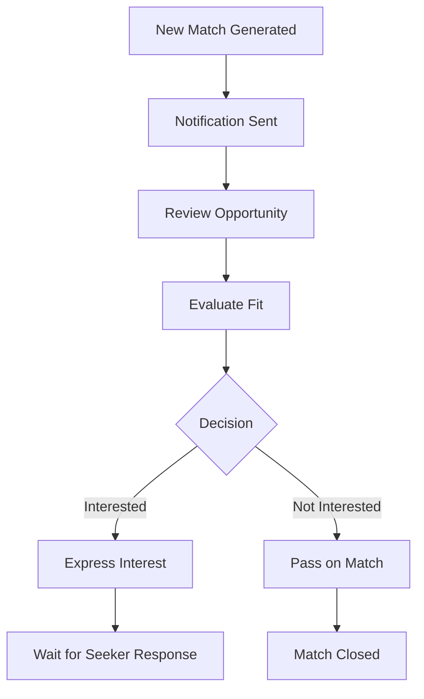

**Match Evaluation:**
- Project alignment with expertise
- Budget compatibility
- Timeline feasibility
- Client company reputation
- Growth opportunity assessment

**Notification Channels:**
- In-app notifications
- Email alerts
- SMS notifications (optional)
- Slack/Teams integration

### 2.2 Interest Expression
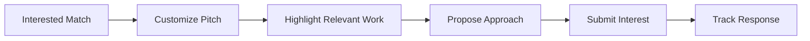

**Interest Components:**
- Personalized message to client
- Relevant portfolio pieces
- Proposed strategy/approach
- Availability confirmation
- Rate expectations

### 3. Offer Response & Negotiation

#### 3.1 Offer Evaluation
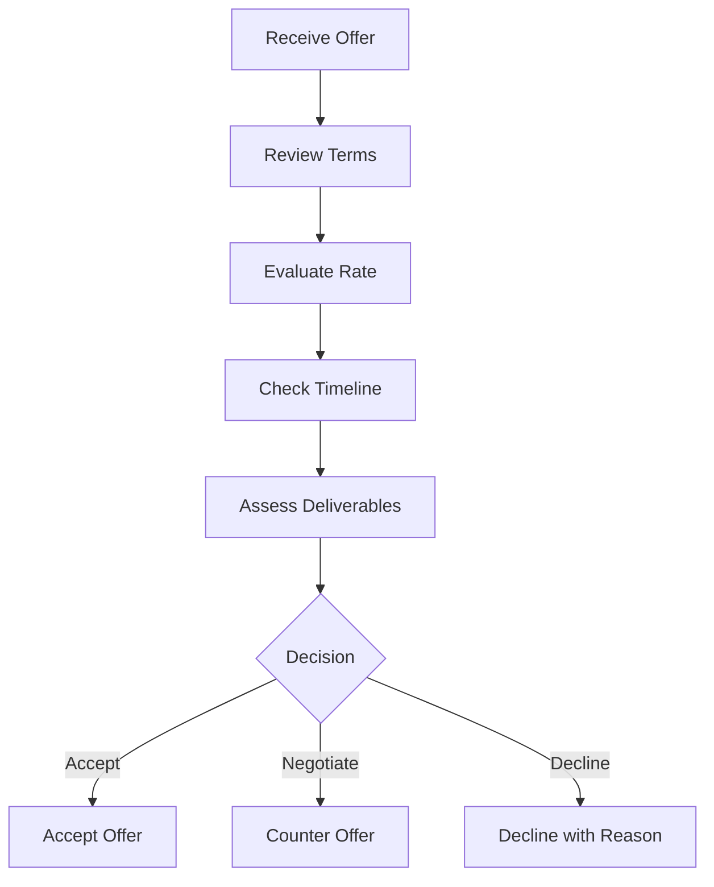

**Evaluation Criteria:**
- Rate competitiveness
- Scope of work clarity
- Timeline reasonableness
- Payment terms
- Usage rights and exclusivity
- Growth potential

#### 3.2 Counter Offer Process
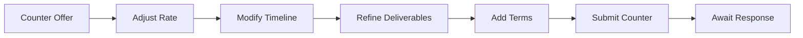

**Counter Offer Options:**
- Rate adjustments
- Timeline modifications
- Deliverable refinements
- Payment term changes
- Additional services
- Exclusivity negotiations

### 4. Work Execution & Delivery

#### 4.1 Engagement Kickoff
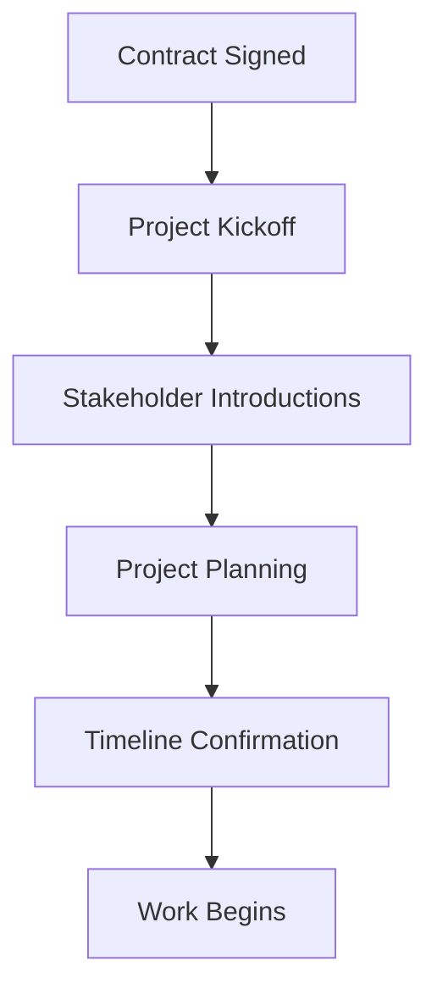

**Kickoff Activities:**
- Client onboarding call
- Project requirements review
- Timeline and milestone alignment
- Communication protocol setup
- Access and resource provisioning

#### 4.2 Work Management
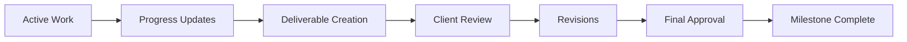

**Work Management Tools:**
- Progress tracking dashboard
- Deliverable submission system
- Client communication center
- Revision management
- Time tracking (if hourly)
- File sharing and collaboration

### 4.3 Time Tracking (Hourly Engagements)
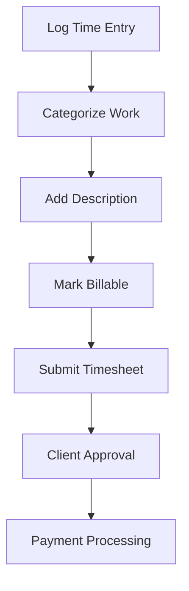

**Timesheet Features:**
- Easy time entry interface
- Task categorization
- Detailed work descriptions
- Billable/non-billable tracking
- Weekly submission workflow
- Approval notifications

### 5. Communication & Collaboration

#### 5.1 Client Communication
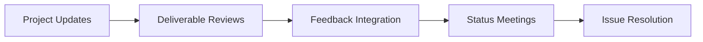

**Communication Tools:**
- Integrated messaging system
- Video call scheduling
- File sharing and comments
- Feedback collection
- Progress reports
- Issue tracking

### 6. Payment & Financial Tracking

#### 6.1 Payment Monitoring
```mermaid
flowchart TD
    A[Milestone Completed] --> B[Payment Pending]
    B --> C[Client Approval]
    C --> D[Payment Released]
    D --> E[Funds Received]
    E --> F[Platform Fee Deducted]
```

**Financial Features:**
- Real-time payment tracking
- Milestone-based releases
- Automatic fee calculations
- Payment history
- Invoice generation
- Tax documentation
- Earnings analytics

## Common User Flows

### 1. Dispute Resolution
```mermaid
flowchart TD
    A[Issue Arises] --> B[Internal Resolution Attempt]
    B --> C{Resolved?}
    C -->|Yes| D[Continue Work]
    C -->|No| E[Escalate to Platform]
    E --> F[Admin Investigation]
    F --> G[Mediation Process]
    G --> H[Resolution Decision]
    H --> I[Payment/Contract Adjustment]
```

### 2. Contract Amendments
```mermaid
flowchart LR
    A[Change Request] --> B[Amendment Proposal]
    B --> C[Negotiation]
    C --> D[Agreement]
    D --> E[Contract Update]
    E --> F[Re-signature]
    F --> G[Updated Engagement]
```

### 3. Engagement Completion
```mermaid
flowchart TD
    A[Final Deliverable] --> B[Client Review]
    B --> C[Completion Verification]
    C --> D[Final Payment Release]
    D --> E[Engagement Closed]
    E --> F[Feedback Exchange]
    F --> G[Relationship Maintenance]
```

## Mobile Experience

### Key Mobile Features
- **Dashboard**: Quick overview of active engagements
- **Notifications**: Real-time alerts for important updates
- **Communication**: Mobile-optimized messaging
- **Time Tracking**: Easy mobile time entry
- **Approvals**: Quick deliverable and payment approvals
- **File Upload**: Camera integration for content submission

### Mobile-Specific Workflows
- Push notification handling
- Offline capability for time tracking
- Mobile payment approvals
- Quick status updates
- Emergency contact features

## Accessibility & Compliance

### Accessibility Features
- WCAG 2.1 AA compliance
- Screen reader compatibility
- Keyboard navigation support
- High contrast mode
- Text scaling support

### Data Privacy
- GDPR compliance workflows
- Data export capabilities
- Account deletion process
- Privacy preference management
- Consent management

## Integration Workflows

### Third-Party Integrations
- **Calendar**: Google Calendar, Outlook integration
- **Communication**: Slack, Teams notifications
- **File Storage**: Google Drive, Dropbox sync
- **Analytics**: Google Analytics, custom tracking
- **Accounting**: QuickBooks, Xero integration

### API Access
- Developer portal access
- API key management
- Webhook configuration
- Rate limit monitoring
- Usage analytics
