# Business Case
## Benchwarmers Marketplace Platform

---

## 📊 **Executive Summary**

Benchwarmers is a revolutionary talent marketplace platform that addresses critical pain points in the $200 billion global recruitment industry. Our AI-powered matching system, streamlined interview process, and secure payment infrastructure deliver measurable ROI for all stakeholders.

### **Key Value Propositions**
- **90% Faster Hiring**: Reduce time-to-hire from 30-60 days to 7-14 days
- **30-50% Cost Savings**: Lower recruitment costs through efficient matching
- **5% Facilitation Fee**: Transparent, value-based pricing model
- **95% Match Accuracy**: AI-powered matching ensures quality outcomes

---

## 🎯 **Market Opportunity**

### **Market Size & Growth**

### **Market Drivers**

### **Competitive Landscape**

| Competitor | Market Share | Strengths | Weaknesses | Our Advantage |
|------------|-------------|-----------|------------|---------------|
| **Traditional Agencies** | 60% | Established relationships | High costs, slow process | 90% faster, 50% cheaper |
| **Freelance Platforms** | 25% | Large talent pool | Poor matching, payment issues | AI matching, secure escrow |
| **Job Boards** | 10% | High visibility | No quality control | Quality-focused matching |
| **Direct Hiring** | 5% | No middleman | Time-intensive, limited reach | Efficient process, broad reach |

---

## 💰 **Financial Projections**

### **Revenue Model**

### **5-Year Revenue Projections**

### **Revenue Breakdown by Year**

| Year | Users | Subscription Revenue | Transaction Revenue | Total Revenue | Growth Rate |
|------|-------|---------------------|-------------------|---------------|-------------|
| **Year 1** | 1,000 | 850K ZAR | 150K ZAR | 1M ZAR | - |
| **Year 2** | 5,000 | 4.25M ZAR | 750K ZAR | 5M ZAR | 400% |
| **Year 3** | 15,000 | 12.75M ZAR | 2.25M ZAR | 15M ZAR | 200% |
| **Year 4** | 30,000 | 25.5M ZAR | 4.5M ZAR | 30M ZAR | 100% |
| **Year 5** | 50,000 | 42.5M ZAR | 7.5M ZAR | 50M ZAR | 67% |

---

## 📈 **ROI Analysis**

### **For Talent Seekers (Companies)**

### **ROI Calculation Example**

**Scenario**: Hiring a Senior Developer (100K ZAR annual salary)

| Metric | Traditional | Benchwarmers | Savings |
|--------|-------------|--------------|---------|
| **Recruitment Cost** | 20K ZAR (20%) | 5K ZAR (5%) | 15K ZAR |
| **Time to Hire** | 45 days | 10 days | 35 days |
| **Productivity Loss** | 12K ZAR | 2.7K ZAR | 9.3K ZAR |
| **Total Cost** | 32K ZAR | 7.7K ZAR | **24.3K ZAR** |

**ROI = 316%** (24.3K savings / 7.7K cost)

### **For Talent Providers (Professionals)**

---

## 🎯 **Customer Acquisition Strategy**

### **Customer Acquisition Funnel**

### **Customer Acquisition Cost (CAC)**

| Channel | Cost per Lead | Conversion Rate | CAC |
|---------|---------------|-----------------|-----|
| **Content Marketing** | 50 ZAR | 2% | 2,500 ZAR |
| **Paid Advertising** | 100 ZAR | 1.5% | 6,667 ZAR |
| **Referrals** | 0 ZAR | 5% | 0 ZAR |
| **Partnerships** | 200 ZAR | 3% | 6,667 ZAR |
| **Average CAC** | | | **3,958 ZAR** |

### **Customer Lifetime Value (CLV)**

```mermaid
graph TD
    A[Average Revenue per User] --> B[850 ZAR/month]
    C[Average Retention] --> D[24 months]
    E[Referral Value] --> F[500 ZAR]
    
    G[CLV Calculation] --> H[850 × 24 + 500]
    H --> I[20,900 ZAR]
    
    J[CLV:CAC Ratio] --> K[20,900 ÷ 3,958]
    K --> L[5.3:1]
    
    style A fill:#e3f2fd
    style G fill:#c8e6c9
    style J fill:#4caf50
```

---

## 🚀 **Growth Strategy**

### **Phase 1: Market Validation (Months 1-6)**

**Targets:**
- 1,000 active users
- 100K ZAR monthly recurring revenue
- 85% user retention rate
- 4.5/5 customer satisfaction

### **Phase 2: Market Expansion (Months 7-18)**

**Targets:**
- 5,000 active users
- 500K ZAR monthly recurring revenue
- 90% user retention rate
- 4.8/5 customer satisfaction

### **Phase 3: Scale & Optimize (Months 19-36)**

**Targets:**
- 15,000 active users
- 1.25M ZAR monthly recurring revenue
- 92% user retention rate
- 4.9/5 customer satisfaction

---

## 💼 **Investment Requirements**

### **Funding Rounds**

### **Use of Funds**

| Category | Seed (2M ZAR) | Series A (10M ZAR) | Series B (50M ZAR) |
|----------|---------------|-------------------|-------------------|
| **Marketing & Sales** | 40% (800K) | 35% (3.5M) | 30% (15M) |
| **Product Development** | 30% (600K) | 30% (3M) | 25% (12.5M) |
| **Team Expansion** | 20% (400K) | 25% (2.5M) | 30% (15M) |
| **Operations** | 10% (200K) | 10% (1M) | 15% (7.5M) |

### **Expected Returns**

---

## 🎯 **Risk Analysis & Mitigation**

### **Market Risks**

### **Operational Risks**

### **Financial Risks**

---

## 📊 **Success Metrics & KPIs**

### **Financial KPIs**

### **Product KPIs**

### **Operational KPIs**

---

## 🎯 **Conclusion & Recommendations**

### **Investment Summary**

Benchwarmers presents a compelling investment opportunity with:

- **Proven Market Need**: $200B global recruitment market
- **Clear Competitive Advantage**: AI-powered matching, 90% faster hiring
- **Scalable Business Model**: 5% facilitation fee, recurring revenue
- **Strong Financial Projections**: 50M ZAR revenue by Year 5
- **Experienced Team**: Proven track record in technology and business

### **Expected Returns**

- **Seed Investors**: 25x return potential over 3-5 years
- **Series A Investors**: 5x return potential over 2-3 years
- **Series B Investors**: 2x return potential over 1-2 years

### **Next Steps**

1. **Due Diligence**: Complete technical and market validation
2. **Pilot Program**: Launch with select enterprise clients
3. **Funding Round**: Secure seed funding for market expansion
4. **Team Expansion**: Hire key personnel for growth
5. **Product Enhancement**: Develop advanced features and mobile app

---

**Benchwarmers is positioned to revolutionize the talent marketplace industry and deliver exceptional returns for investors while creating significant value for all stakeholders. 🚀**

*Ready to invest in the future of talent acquisition?*
