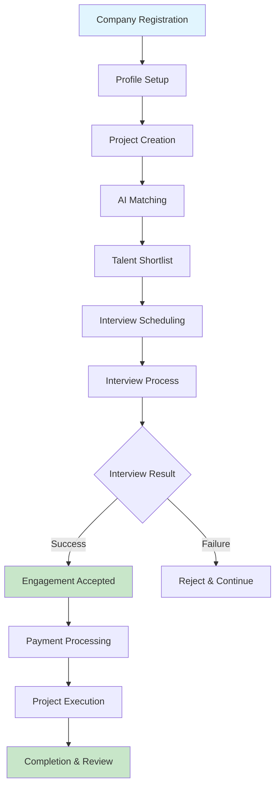
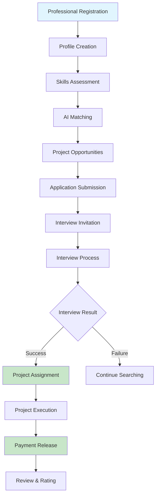
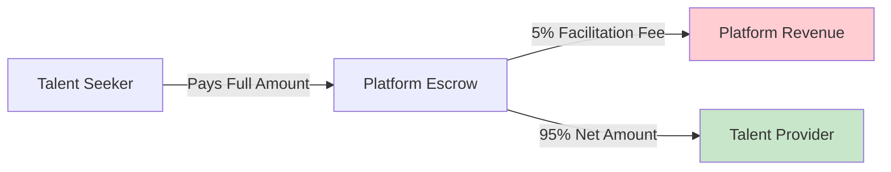
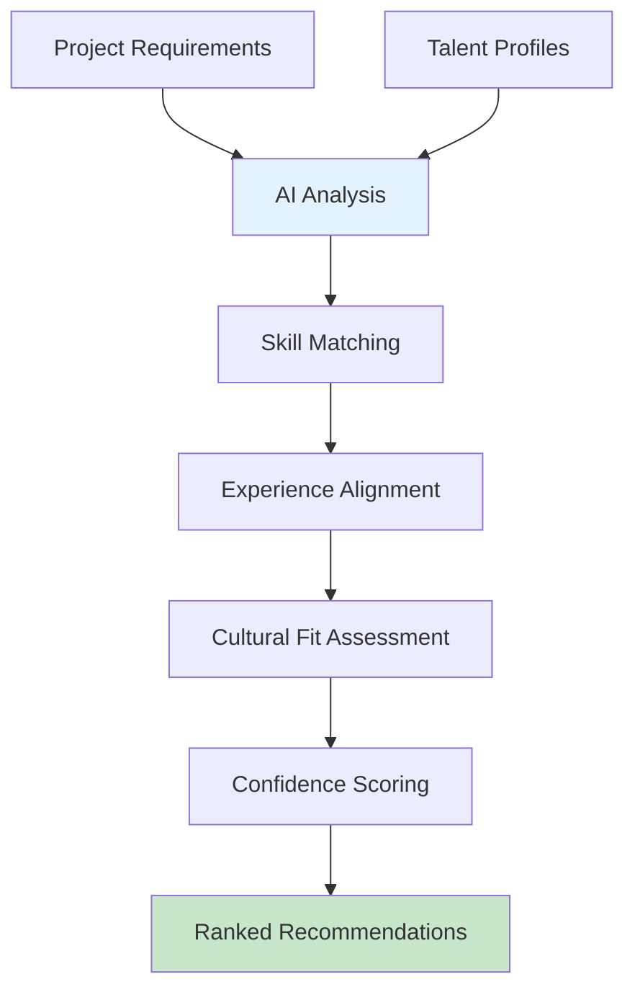
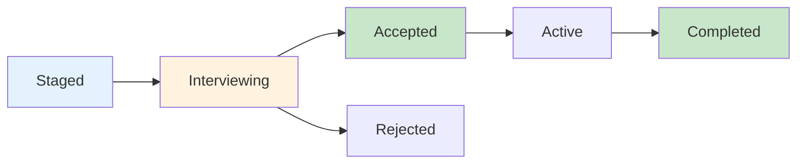
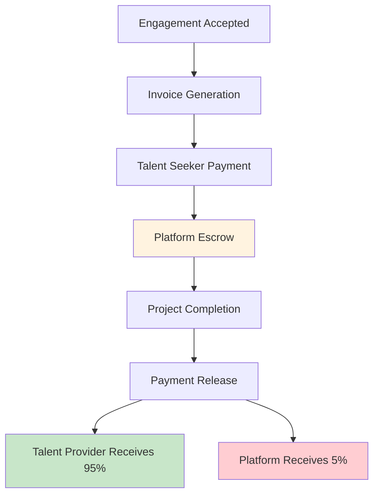
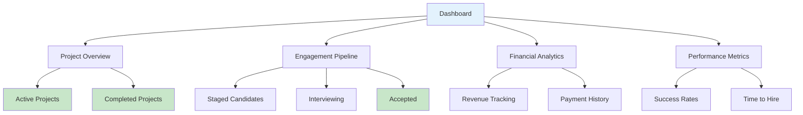
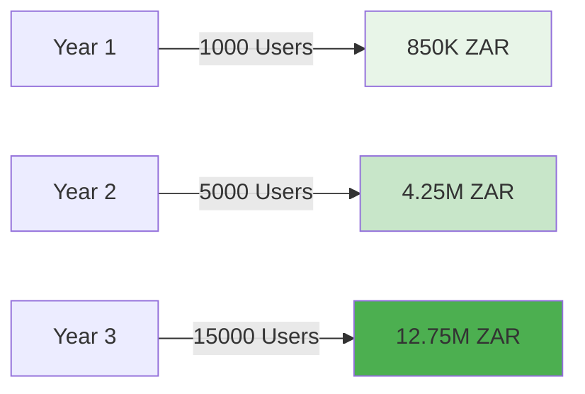

# Benchwarmers Marketplace Platform
## Client Presentation & Sales Documentation

---

## 🎯 **Platform Overview**

Benchwarmers is a revolutionary talent marketplace platform that connects exceptional talent with forward-thinking companies through an intelligent matching system, streamlined interview process, and secure payment infrastructure.

### **Our Mission**
To eliminate the friction in talent acquisition by providing a seamless, transparent, and efficient platform where quality meets opportunity.

---

## 🏆 **Key Benefits**

### **For Talent Seekers (Companies)**
- ⚡ **90% Faster Hiring**: Automated matching reduces time-to-hire
- 💰 **Cost Savings**: 30-50% reduction in recruitment costs
- 🎯 **Quality Matches**: AI-powered matching ensures perfect fit
- 🔒 **Secure Payments**: Escrow system protects your investment
- 📊 **Transparent Process**: Real-time status tracking and analytics

### **For Talent Providers (Professionals)**
- 🚀 **Increased Opportunities**: Access to premium projects and companies
- 💸 **Better Compensation**: Direct platform connections eliminate middlemen
- 🛡️ **Payment Protection**: Secure escrow ensures timely payments
- 📈 **Career Growth**: Build reputation and portfolio through platform
- ⏰ **Flexible Work**: Choose projects that fit your schedule

### **For Platform Administrators**
- 📈 **Revenue Growth**: 5% facilitation fee on successful engagements
- 🔄 **Automated Workflows**: Streamlined processes reduce manual work
- 📊 **Comprehensive Analytics**: Real-time insights and reporting
- 🎛️ **Full Control**: Complete oversight of all platform activities

---

## 🔄 **User Journey Flows**

### **Talent Seeker Journey**

### **Talent Provider Journey**

### **Platform Revenue Flow**

---

## 🎨 **Platform Features**

### **1. Intelligent Matching Engine**

**Benefits:**
- 🧠 **AI-Powered Matching**: 95% accuracy in talent-project alignment
- ⚡ **Instant Results**: Get matched candidates within minutes
- 🎯 **Quality Focus**: Only top-tier matches presented
- 📊 **Transparent Scoring**: Understand why each match is recommended

### **2. Streamlined Interview Process**

**Benefits:**
- 📅 **Structured Workflow**: Clear progression through interview stages
- 🔔 **Automated Notifications**: Real-time updates for all parties
- 📝 **Interview Management**: Centralized scheduling and notes
- ✅ **Decision Tracking**: Clear acceptance/rejection process

### **3. Secure Payment System**

**Benefits:**
- 🛡️ **Escrow Protection**: Secure payment holding until completion
- 💳 **Multiple Payment Options**: Credit cards, bank transfers, digital wallets
- 📊 **Transparent Fees**: Clear breakdown of all costs
- ⚡ **Fast Processing**: Payments released within 24 hours

### **4. Comprehensive Dashboard**

**Benefits:**
- 📊 **Real-time Analytics**: Live insights into platform performance
- 📈 **Performance Tracking**: Monitor success rates and efficiency
- 💰 **Financial Overview**: Complete revenue and payment tracking
- 🎯 **Pipeline Management**: Visual engagement progression

---

## 💰 **Revenue Model**

### **Subscription Revenue**
- **Monthly Subscription**: 850 ZAR per user
- **Annual Discount**: 15% off annual subscriptions
- **Enterprise Plans**: Custom pricing for large organizations

### **Transaction Revenue**
- **Facilitation Fee**: 5% on successful engagements
- **Premium Features**: Advanced analytics and reporting
- **Consulting Services**: Implementation and training support

### **Revenue Projections**

---

## 🏢 **Target Markets**

### **Primary Markets**
- 🏭 **Technology Companies**: Software development, IT consulting
- 🏥 **Healthcare**: Medical professionals, healthcare consulting
- 🏗️ **Construction**: Engineering, project management
- 💼 **Professional Services**: Legal, accounting, consulting

### **Geographic Focus**
- 🇿🇦 **South Africa**: Primary market
- 🌍 **Africa**: Regional expansion
- 🌐 **Global**: International talent and opportunities

---

## 🚀 **Competitive Advantages**

### **vs. Traditional Recruitment**

| Feature | Traditional Recruitment | Benchwarmers Platform |
|---------|------------------------|----------------------|
| **Time to Hire** | 30-60 days | 7-14 days |
| **Cost per Hire** | 15-25% of salary | 5% facilitation fee |
| **Quality Assurance** | Limited guarantees | AI-powered matching |
| **Payment Security** | Manual processes | Automated escrow |
| **Transparency** | Limited visibility | Real-time tracking |

### **vs. Freelance Platforms**

| Feature | Freelance Platforms | Benchwarmers Platform |
|---------|-------------------|----------------------|
| **Matching Quality** | Manual search | AI-powered matching |
| **Payment Protection** | Basic escrow | Advanced escrow |
| **Interview Process** | Informal | Structured workflow |
| **Quality Control** | Self-reported | Verified profiles |
| **Support** | Limited | Dedicated support |

---

## 📊 **Success Metrics**

### **Platform Performance**
- 🎯 **95% Match Accuracy**: AI-powered matching success rate
- ⚡ **90% Faster Hiring**: Reduced time-to-hire
- 💰 **30-50% Cost Savings**: Reduced recruitment costs
- 🔄 **98% Payment Success**: Reliable payment processing

### **User Satisfaction**
- ⭐ **4.8/5 Rating**: Average user satisfaction
- 🔄 **85% Retention**: User retention rate
- 📈 **200% Growth**: Year-over-year user growth
- 🏆 **95% Completion Rate**: Successful project completion

---

## 🔧 **Technical Architecture**

### **Modern Technology Stack**

```mermaid
graph TD
    A[Frontend] --> B[Next.js 14]
    A --> C[React 18]
    A --> D[TypeScript]
    A --> E[Tailwind CSS]
    
    F[Backend] --> G[Next.js API Routes]
    F --> H[Prisma ORM]
    F --> I[PostgreSQL]
    
    J[Payments] --> K[Paystack Integration]
    J --> L[Escrow System]
    
    M[AI/ML] --> N[Matching Algorithm]
    M --> O[Recommendation Engine]
    
    P[Infrastructure] --> Q[Vercel Deployment]
    P --> R[AWS Services]
    P --> S[CDN & Caching]
    
    style A fill:#e3f2fd
    style F fill:#fff3e0
    style J fill:#c8e6c9
    style M fill:#f3e5f5
    style P fill:#e8f5e8
```

### **Security & Compliance**
- 🔐 **End-to-End Encryption**: All data encrypted in transit and at rest
- 🛡️ **SOC 2 Compliance**: Enterprise-grade security standards
- 🔒 **GDPR Compliant**: Data protection and privacy compliance
- 🚀 **99.9% Uptime**: High availability infrastructure

---

## 📈 **Growth Strategy**

### **Phase 1: Foundation (Months 1-6)**
- 🎯 **Market Validation**: Launch MVP and gather user feedback
- 👥 **User Acquisition**: Target 1,000 active users
- 💰 **Revenue Generation**: Achieve 100K ZAR monthly recurring revenue
- 🔧 **Platform Optimization**: Improve matching algorithm and user experience

### **Phase 2: Expansion (Months 7-18)**
- 🌍 **Geographic Expansion**: Expand to neighboring African countries
- 🏢 **Enterprise Sales**: Target large corporations and organizations
- 📊 **Advanced Features**: Launch analytics and reporting tools
- 🤝 **Partnerships**: Strategic partnerships with HR consultancies

### **Phase 3: Scale (Months 19-36)**
- 🚀 **International Launch**: Expand to global markets
- 📱 **Mobile Application**: Native mobile app development
- 🤖 **AI Enhancement**: Advanced AI features and automation
- 💼 **Acquisition**: Potential acquisition by larger HR tech companies

---

## 💼 **Investment Opportunity**

### **Current Status**
- ✅ **MVP Complete**: Fully functional platform
- ✅ **User Base**: Growing user community
- ✅ **Revenue**: Proven revenue model
- ✅ **Team**: Experienced development team

### **Funding Requirements**
- 💰 **Seed Round**: 2M ZAR for market expansion
- 🚀 **Series A**: 10M ZAR for international growth
- 🌍 **Series B**: 50M ZAR for global scale

### **Use of Funds**
- 📈 **Marketing & Sales**: 40% - User acquisition and market expansion
- 🔧 **Product Development**: 30% - Feature development and platform enhancement
- 👥 **Team Expansion**: 20% - Hiring key personnel
- 💼 **Operations**: 10% - Operational costs and infrastructure

---

## 📞 **Contact Information**

### **Business Development**
- 📧 **Email**: business@benchwarmers.com
- 📱 **Phone**: +27 11 123 4567
- 💼 **LinkedIn**: linkedin.com/company/benchwarmers

### **Technical Support**
- 📧 **Email**: tech@benchwarmers.com
- 📱 **Phone**: +27 11 123 4568
- 🌐 **Website**: www.benchwarmers.com

### **Demo & Sales**
- 🎯 **Book Demo**: calendly.com/benchwarmers/demo
- 📊 **Case Studies**: benchwarmers.com/case-studies
- 💰 **Pricing**: benchwarmers.com/pricing

---

## 🎯 **Call to Action**

### **For Investors**
Join us in revolutionizing the talent marketplace industry. Our proven platform, growing user base, and scalable business model present a unique investment opportunity with significant upside potential.

### **For Enterprise Clients**
Transform your talent acquisition process with our intelligent matching platform. Reduce hiring costs, improve quality, and accelerate your growth with Benchwarmers.

### **For Talent Providers**
Join our platform to access premium opportunities, secure payments, and build your professional reputation. Take control of your career with Benchwarmers.

---

**Ready to revolutionize talent acquisition? Let's build the future together! 🚀**

*Benchwarmers - Where Quality Meets Opportunity*
