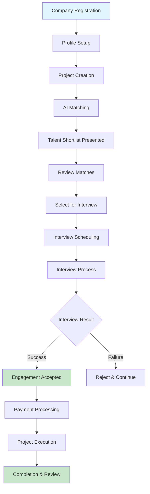
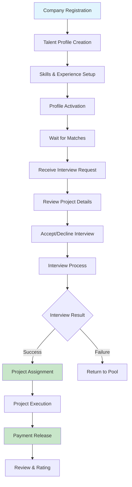
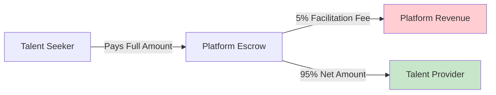
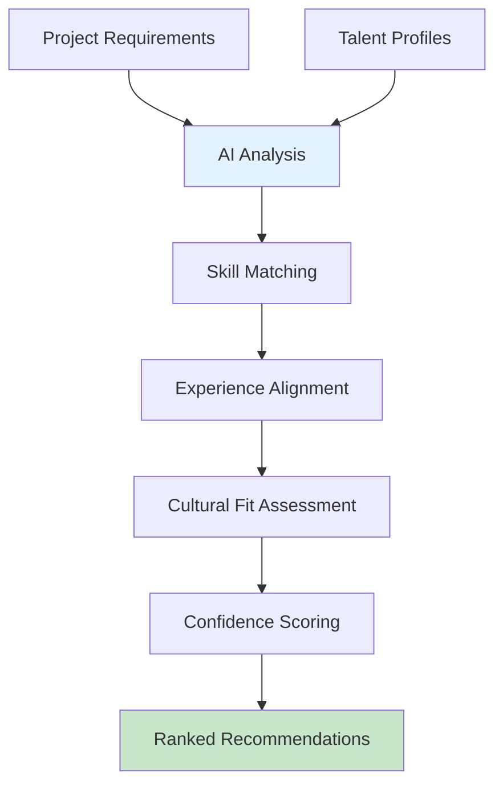
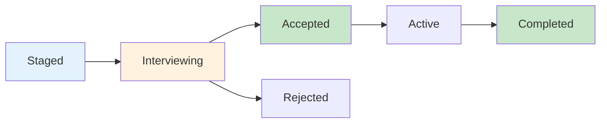
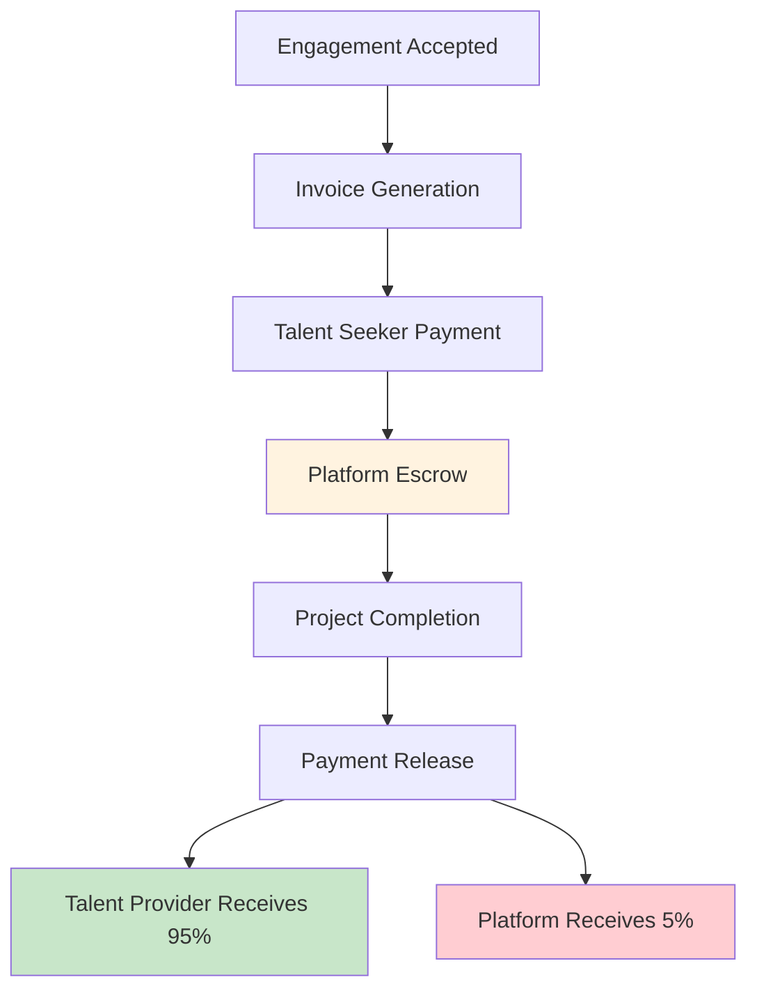
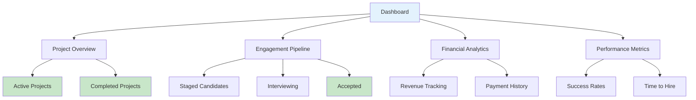

# Benchwarmers Marketplace Platform
## Client Presentation & Sales Documentation

---

## 🎯 **Platform Overview**

Benchwarmers is a revolutionary talent marketplace platform that connects exceptional talent with forward-thinking companies through an intelligent matching system, streamlined interview process, and secure payment infrastructure.

### **Our Mission**
To eliminate the friction in talent acquisition by providing a seamless, transparent, and efficient platform where quality meets opportunity.

---

## 🏆 **Key Benefits**

### **For Talent Seekers (Companies with Projects)**
- ⚡ **90% Faster Hiring**: Automated matching reduces time-to-hire
- 💰 **Cost Savings**: 30-50% reduction in recruitment costs
- 🎯 **Quality Matches**: AI-powered matching ensures perfect fit
- 🔒 **Secure Payments**: Escrow system protects your investment
- 📊 **Transparent Process**: Real-time status tracking and analytics
- 🛡️ **No Spam**: Only receive curated, high-quality talent matches

### **For Talent Providers (Companies with Benched Talent)**
- 🚀 **Passive Income**: Monetize benched professionals during downtime
- 💸 **Better Revenue**: Direct platform connections eliminate middlemen
- 🛡️ **Payment Protection**: Secure escrow ensures timely payments
- 📈 **Professional Growth**: Build reputation and portfolio through platform
- ⏰ **Zero Spam**: No need to apply - get notified when selected for interviews

### **For Platform Administrators**
- 📈 **Revenue Growth**: 5% facilitation fee on successful engagements
- 🔄 **Automated Workflows**: Streamlined processes reduce manual work
- 📊 **Comprehensive Analytics**: Real-time insights and reporting
- 🎛️ **Full Control**: Complete oversight of all platform activities

---

## 🔄 **User Journey Flows**

### **Talent Seeker Journey (Companies with Projects)**

### **Talent Provider Journey (Companies with Benched Talent)**

### **Platform Revenue Flow**

---

## 🎨 **Platform Features**

### **1. Intelligent Matching Engine**

**Benefits:**
- 🧠 **AI-Powered Matching**: 95% accuracy in talent-project alignment
- ⚡ **Instant Results**: Get matched candidates within minutes
- 🎯 **Quality Focus**: Only top-tier matches presented
- 📊 **Transparent Scoring**: Understand why each match is recommended
- 🛡️ **Anti-Spam**: No unsolicited applications - only curated matches

### **2. Streamlined Interview Process**

**Benefits:**
- 📅 **Structured Workflow**: Clear progression through interview stages
- 🔔 **Automated Notifications**: Real-time updates for all parties
- 📝 **Interview Management**: Centralized scheduling and notes
- ✅ **Decision Tracking**: Clear acceptance/rejection process
- 🎯 **Seeker-Driven**: Talent seekers control the interview process

### **3. Secure Payment System**

**Benefits:**
- 🛡️ **Escrow Protection**: Secure payment holding until completion
- 💳 **Multiple Payment Options**: Credit cards, bank transfers, digital wallets
- 📊 **Transparent Fees**: Clear breakdown of all costs
- ⚡ **Fast Processing**: Payments released within 24 hours

### **4. Comprehensive Dashboard**

**Benefits:**
- 📊 **Real-time Analytics**: Live insights into platform performance
- 📈 **Performance Tracking**: Monitor success rates and efficiency
- 💰 **Financial Overview**: Complete revenue and payment tracking
- 🎯 **Pipeline Management**: Visual engagement progression

---

## 💰 **Revenue Model**

### **Subscription Model**
- **Monthly Subscription**: 850 ZAR per user
- **Access Level**: Full platform access for talent seekers and providers
- **Billing Cycle**: Monthly recurring payments

### **Transaction Fees**
- **Facilitation Fee**: 5% on successful engagements
- **Payment Processing**: Integrated with Paystack for secure transactions
- **Escrow Service**: Included in facilitation fee

### **Revenue Streams**
1. **Subscription Revenue**: Predictable monthly income
2. **Transaction Fees**: Revenue from successful engagements
3. **Premium Features**: Advanced analytics and reporting (future)

---

## 🎯 **Target Markets**

### **Primary Markets**
- **South Africa**: Initial market focus
- **Technology Companies**: High demand for skilled talent
- **Consulting Firms**: Project-based work requirements
- **Startups**: Flexible talent needs

### **Secondary Markets**
- **Financial Services**: Regulatory project requirements
- **Healthcare**: Digital transformation projects
- **Manufacturing**: Process improvement initiatives
- **Education**: Technology integration projects

---

## 🏆 **Competitive Advantages**

### **Unique Value Propositions**
1. **Anti-Spam Protection**: No unsolicited applications
2. **Quality-First Approach**: Only curated matches presented
3. **Seeker-Driven Process**: Talent seekers control the flow
4. **Provider Passive Income**: Monetize benched talent
5. **Secure Payment System**: Escrow protection for all parties

### **Market Differentiation**
- **vs. Traditional Recruiters**: 90% faster, 50% cheaper
- **vs. Freelance Platforms**: Quality-focused, no spam
- **vs. Job Boards**: AI-powered matching, not just listings
- **vs. Consulting Firms**: Direct access, lower costs

---

## 📈 **Success Metrics**

### **Key Performance Indicators**
- **Time to Hire**: Target 90% reduction
- **Match Quality**: 95% satisfaction rate
- **Platform Revenue**: 5% month-over-month growth
- **User Retention**: 85% monthly retention rate
- **Payment Success**: 99.9% successful transactions

### **Business Metrics**
- **Monthly Active Users**: Target 10,000 by year 2
- **Successful Engagements**: Target 1,000 per month
- **Average Transaction Value**: 50,000 ZAR
- **Customer Acquisition Cost**: < 500 ZAR
- **Lifetime Value**: > 10,000 ZAR

---

## 🏗️ **Technical Architecture**

### **Modern Tech Stack**
- **Frontend**: Next.js 15, TypeScript, Tailwind CSS
- **Backend**: Node.js, Prisma ORM, PostgreSQL
- **Payments**: Paystack integration
- **Real-time**: Pusher for notifications
- **Email**: Resend for transactional emails
- **SMS**: Twilio for phone verification

### **Security & Compliance**
- **Data Protection**: GDPR compliant
- **Payment Security**: PCI DSS standards
- **Encryption**: End-to-end data encryption
- **Audit Trails**: Complete activity logging

---

## 🚀 **Growth Strategy**

### **Phase 1: Foundation (Months 1-6)**
- **Market Validation**: 100 active users
- **Feature Development**: Core platform functionality
- **Payment Integration**: Paystack implementation
- **Security Audit**: Comprehensive security review

### **Phase 2: Growth (Months 7-18)**
- **User Acquisition**: 1,000 active users
- **Feature Expansion**: Advanced analytics
- **Market Expansion**: Additional industries
- **Partnership Development**: Strategic alliances

### **Phase 3: Scale (Months 19-36)**
- **Market Leadership**: 10,000 active users
- **Geographic Expansion**: Regional markets
- **Product Diversification**: Additional services
- **International Launch**: Global platform

---

## 💼 **Investment Opportunity**

### **Funding Requirements**
- **Seed Round**: 2M ZAR
- **Series A**: 10M ZAR (Year 2)
- **Series B**: 50M ZAR (Year 4)

### **Use of Funds**
- **Product Development**: 40%
- **Marketing & Sales**: 30%
- **Operations**: 20%
- **Working Capital**: 10%

### **Expected Returns**
- **Year 3 Revenue**: 50M ZAR
- **Year 5 Revenue**: 200M ZAR
- **Exit Valuation**: 500M ZAR (Year 7)
- **ROI**: 25x return potential

---

## 📞 **Contact Information**

### **Business Development**
- **Email**: business@benchwarmers.com
- **Phone**: +27 11 123 4567
- **Website**: https://benchwarmers.com

### **Technical Support**
- **Email**: support@benchwarmers.com
- **Documentation**: https://docs.benchwarmers.com
- **Status Page**: https://status.benchwarmers.com

### **Partnership Inquiries**
- **Email**: partnerships@benchwarmers.com
- **LinkedIn**: https://linkedin.com/company/benchwarmers
- **Twitter**: https://twitter.com/benchwarmers

---

**Benchwarmers - Transforming Downtime into Opportunity**

*Proudly developed by [TOSH (The Only Software Hub)](https://tosh.co.za/)*
