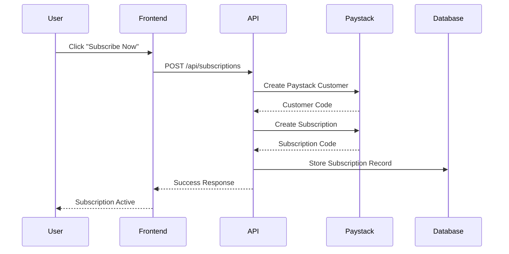
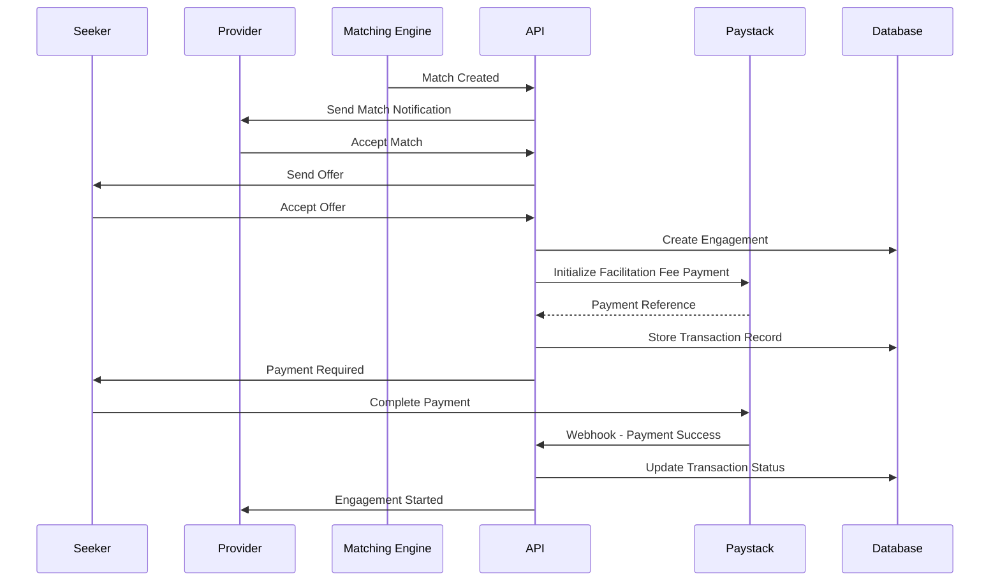
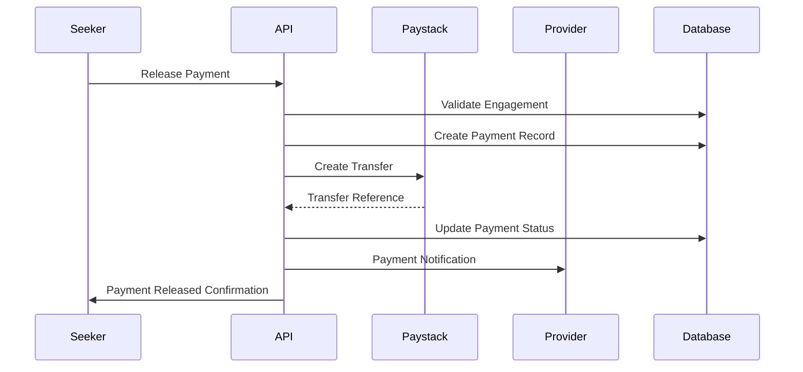

# Payment, Billing & Invoicing Flows

## Overview

This document outlines the complete payment, billing, and invoicing flows for the Benchwarmers marketplace platform. The system uses Paystack for payment processing and implements a subscription model with facilitation fees.

## Business Model

### Revenue Streams

1. **Subscription Revenue**: 850 ZAR per month per user
2. **Facilitation Fees**: 5% of transaction amount when deals are struck between seekers and providers

### Payment Infrastructure

- **Payment Processor**: Paystack
- **Currency**: ZAR (South African Rand)
- **Subscription Plan Code**: `PLN_npx4dizl78ab5i9`

## 1. Subscription Flow

### 1.1 Subscription Creation



**API Endpoint**: `POST /api/subscriptions`

**Request Body**:
```json
{
  "planType": "monthly"
}
```

**Response**:
```json
{
  "success": true,
  "subscription": {
    "id": "sub_123",
    "planType": "monthly",
    "amount": 850,
    "currency": "ZAR",
    "status": "active",
    "nextBillingDate": "2024-02-15T00:00:00Z"
  }
}
```

### 1.2 Subscription Management

**Get Status**: `GET /api/subscriptions`
**Cancel**: `POST /api/subscriptions/cancel`

### 1.3 Subscription Renewal

- Automatic monthly billing via Paystack
- Webhook notifications for renewal events
- Grace period handling for failed payments

## 2. Facilitation Fee Flow

### 2.1 When a Deal is Struck



### 2.2 Facilitation Fee Calculation

```typescript
// Example: R10,000 project
const projectAmount = 10000;
const facilitationFee = projectAmount * 0.05; // R500
const netAmount = projectAmount - facilitationFee; // R9,500
```

**Fee Structure**:
- **Rate**: 5% of transaction amount
- **Minimum**: R50
- **Maximum**: No limit
- **Currency**: ZAR

### 2.3 Payment Processing

**API Endpoint**: `POST /api/payments/process`

**Request Body**:
```json
{
  "engagementId": "eng_123",
  "amount": 10000,
  "currency": "ZAR",
  "paymentMethod": "card"
}
```

**Response**:
```json
{
  "success": true,
  "payment": {
    "id": "pay_123",
    "amount": 10000,
    "facilitationFee": 500,
    "netAmount": 9500,
    "status": "processing",
    "paystackReference": "TXN_123456789"
  }
}
```

## 3. Escrow Payment Flow

### 3.1 Payment Release Process



### 3.2 Payment Release API

**Endpoint**: `POST /api/payments/release`

**Request Body**:
```json
{
  "engagementId": "eng_123",
  "amount": 5000,
  "currency": "ZAR",
  "reason": "milestone",
  "milestoneId": "mil_123",
  "verificationData": {
    "deliverables": ["feature1", "feature2"],
    "approvedBy": "user_123",
    "approvedAt": "2024-01-15T10:00:00Z",
    "notes": "Milestone completed successfully"
  }
}
```

### 3.3 Payment Hold (Disputes)

**Endpoint**: `POST /api/payments/hold`

**Request Body**:
```json
{
  "engagementId": "eng_123",
  "amount": 5000,
  "currency": "ZAR",
  "reason": "dispute",
  "notes": "Quality issues identified"
}
```

## 4. Webhook Processing

### 4.1 Paystack Webhooks

**Endpoint**: `POST /api/webhooks/paystack`

**Supported Events**:
- `charge.success` - Payment completed
- `subscription.create` - Subscription created
- `subscription.disable` - Subscription cancelled
- `transfer.success` - Transfer completed
- `transfer.failed` - Transfer failed

### 4.2 Webhook Verification

```typescript
// Verify webhook signature
const crypto = require('crypto');
const hash = crypto
  .createHmac('sha512', process.env.PAYSTACK_WEBHOOK_SECRET!)
  .update(payload)
  .digest('hex');

if (hash !== signature) {
  throw new Error('Invalid webhook signature');
}
```

## 5. Invoice Generation

### 5.1 Invoice Types

1. **Subscription Invoices**: Monthly 850 ZAR
2. **Facilitation Fee Invoices**: 5% of transaction amount
3. **Payment Release Invoices**: For provider payments

### 5.2 Invoice Structure

```json
{
  "invoiceNumber": "INV-2024-001",
  "date": "2024-01-15",
  "dueDate": "2024-01-15",
  "customer": {
    "name": "Company Name",
    "email": "company@example.com"
  },
  "items": [
    {
      "description": "Monthly Subscription",
      "quantity": 1,
      "unitPrice": 850,
      "total": 850
    }
  ],
  "subtotal": 850,
  "tax": 0,
  "total": 850,
  "currency": "ZAR"
}
```

## 6. Database Schema

### 6.1 Subscription Model

```prisma
model Subscription {
  id                      String    @id @default(cuid())
  userId                  String    @map("user_id")
  companyId               String?   @map("company_id")
  paystackSubscriptionId  String    @unique @map("paystack_subscription_id")
  paystackCustomerId      String    @map("paystack_customer_id")
  planType                String    @map("plan_type")
  amount                  Decimal   @db.Decimal(10, 2)
  currency                String    @default("ZAR")
  status                  String    @default("active")
  startDate               DateTime  @map("start_date")
  nextBillingDate         DateTime  @map("next_billing_date")
  lastBillingDate         DateTime? @map("last_billing_date")
  cancelledAt             DateTime? @map("cancelled_at")
  metadata                Json?
  createdAt               DateTime  @default(now()) @map("created_at")
  updatedAt               DateTime  @updatedAt @map("updated_at")
}
```

### 6.2 Transaction Model

```prisma
model Transaction {
  id                   String            @id @default(cuid())
  engagementId         String?           @map("engagement_id")
  type                 TransactionType
  amount               Decimal           @db.Decimal(10, 2)
  facilitationFee      Decimal?          @map("facilitation_fee") @db.Decimal(10, 2)
  netAmount            Decimal?          @map("net_amount") @db.Decimal(10, 2)
  currency             String            @default("ZAR")
  status               TransactionStatus @default(pending)
  reason               String?
  paystackPaymentId    String?           @map("paystack_payment_id")
  milestoneId          String?           @map("milestone_id")
  processedAt          DateTime?         @map("processed_at")
  description          String?
  metadata             Json?
  createdAt            DateTime          @default(now()) @map("created_at")
  updatedAt            DateTime          @updatedAt @map("updated_at")
}
```

## 7. Error Handling

### 7.1 Payment Failures

- **Insufficient Funds**: Retry with exponential backoff
- **Invalid Payment Method**: Prompt user to update
- **Network Errors**: Retry up to 3 times
- **Webhook Failures**: Queue for retry

### 7.2 Subscription Issues

- **Payment Failure**: Grace period of 7 days
- **Card Expiry**: Email notification to update
- **Account Suspension**: After 3 failed attempts

## 8. Security Considerations

### 8.1 Payment Security

- All payment data encrypted in transit
- Webhook signature verification
- PCI DSS compliance through Paystack
- No sensitive data stored locally

### 8.2 Access Control

- Subscription required for premium features
- Role-based access to payment functions
- Audit logging for all payment operations

## 9. Monitoring & Analytics

### 9.1 Key Metrics

- Monthly Recurring Revenue (MRR)
- Facilitation Fee Revenue
- Payment Success Rate
- Subscription Churn Rate
- Average Transaction Value

### 9.2 Alerts

- Failed payment attempts
- Webhook processing errors
- Subscription cancellations
- High dispute rates

## 10. Testing

### 10.1 Test Environment

- Paystack test keys configured
- Mock payment processing
- Webhook simulation
- Database seeding

### 10.2 Test Scenarios

- Subscription creation/cancellation
- Payment processing success/failure
- Webhook handling
- Dispute resolution
- Refund processing

## 11. Deployment Checklist

- [ ] Paystack production keys configured
- [ ] Webhook endpoints secured
- [ ] Database migrations applied
- [ ] SSL certificates installed
- [ ] Monitoring alerts configured
- [ ] Backup procedures tested
- [ ] Disaster recovery plan documented

## 12. Support & Troubleshooting

### 12.1 Common Issues

1. **Payment Declined**: Check card details and funds
2. **Subscription Not Active**: Verify payment status
3. **Webhook Failures**: Check signature and endpoint
4. **Transfer Delays**: Verify recipient details

### 12.2 Support Contacts

- **Technical Issues**: tech@benchwarmers.com
- **Payment Issues**: payments@benchwarmers.com
- **Billing Questions**: billing@benchwarmers.com
