# User Experience Guide
## Benchwarmers Marketplace Platform

---

## 🎨 **Design Philosophy**

Our platform is built on the principles of **simplicity**, **efficiency**, and **transparency**. Every interaction is designed to reduce friction and maximize value for all users.

### **Core Design Principles**
- 🎯 **User-Centric**: Every feature serves a clear user need
- ⚡ **Efficiency-First**: Minimize clicks, maximize results
- 🔍 **Transparency**: Clear visibility into all processes
- 🛡️ **Trust-Building**: Secure, reliable, and professional

---

## 👥 **User Personas**

### **Talent Seeker (Company)**
- **Name**: Sarah, HR Director at TechCorp
- **Goals**: Hire quality talent quickly and cost-effectively
- **Pain Points**: Long hiring cycles, high recruitment costs, poor candidate quality
- **Success Metrics**: Time-to-hire, cost-per-hire, candidate satisfaction

### **Talent Provider (Professional)**
- **Name**: David, Senior Software Developer
- **Goals**: Find meaningful projects with fair compensation
- **Pain Points**: Unreliable payments, poor project quality, limited opportunities
- **Success Metrics**: Project success rate, payment reliability, career growth

### **Platform Administrator**
- **Name**: Maria, Platform Operations Manager
- **Goals**: Ensure smooth operations and maximize platform revenue
- **Pain Points**: Manual processes, poor visibility, operational inefficiencies
- **Success Metrics**: Platform revenue, user satisfaction, operational efficiency

---

## 🔄 **User Journey Maps**

### **Talent Seeker Journey**


### **Talent Provider Journey**

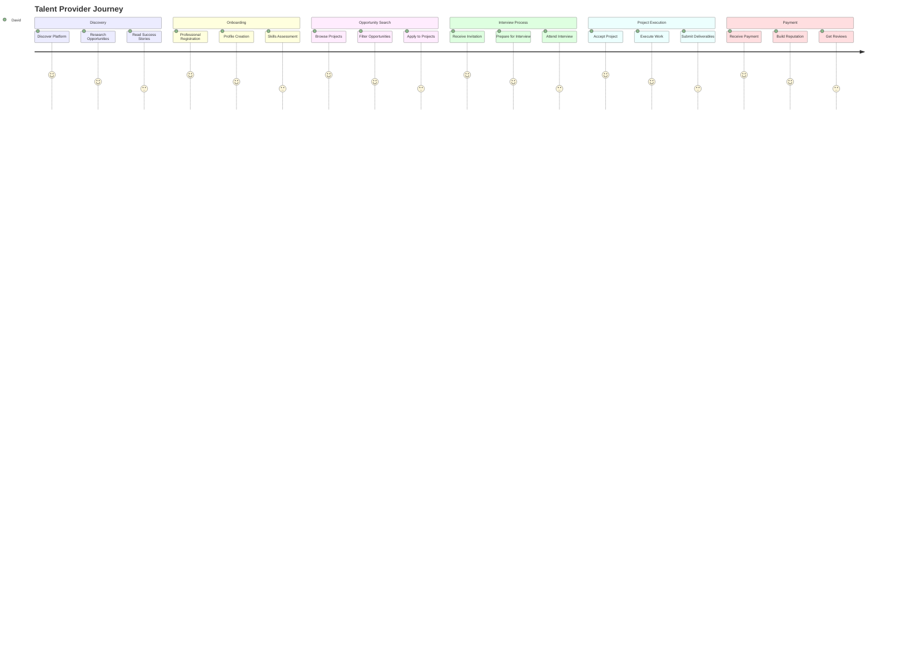

---

## 🎨 **Interface Design System**

### **Color Palette**

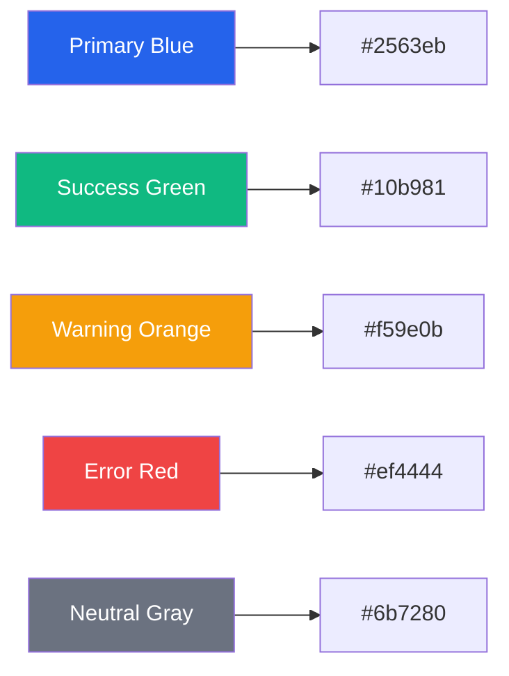

### **Typography Hierarchy**

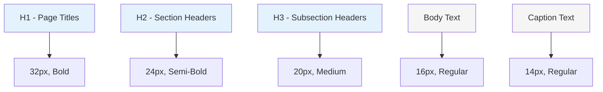

### **Component Library**

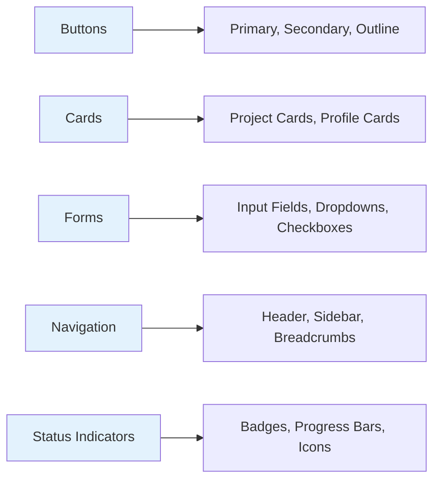

---

## 📱 **Responsive Design**

### **Breakpoint Strategy**

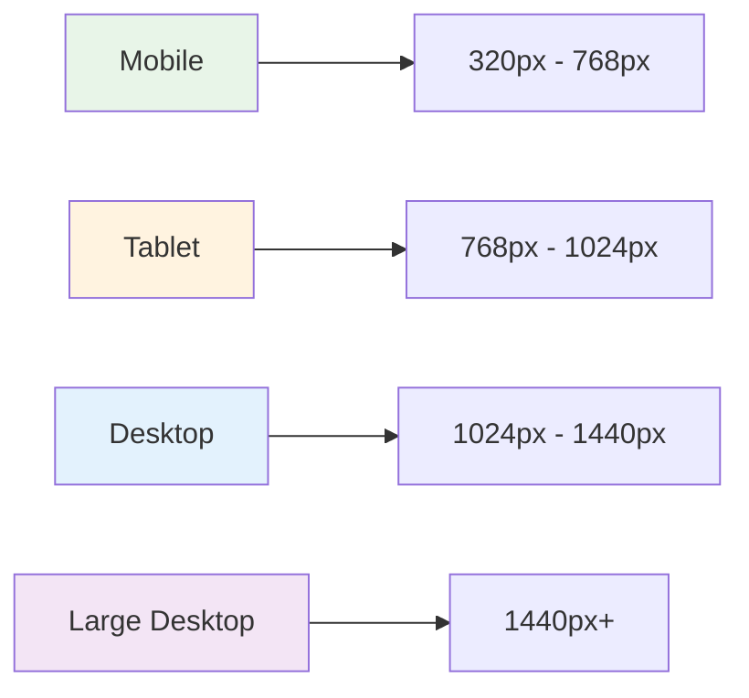

### **Mobile-First Approach**

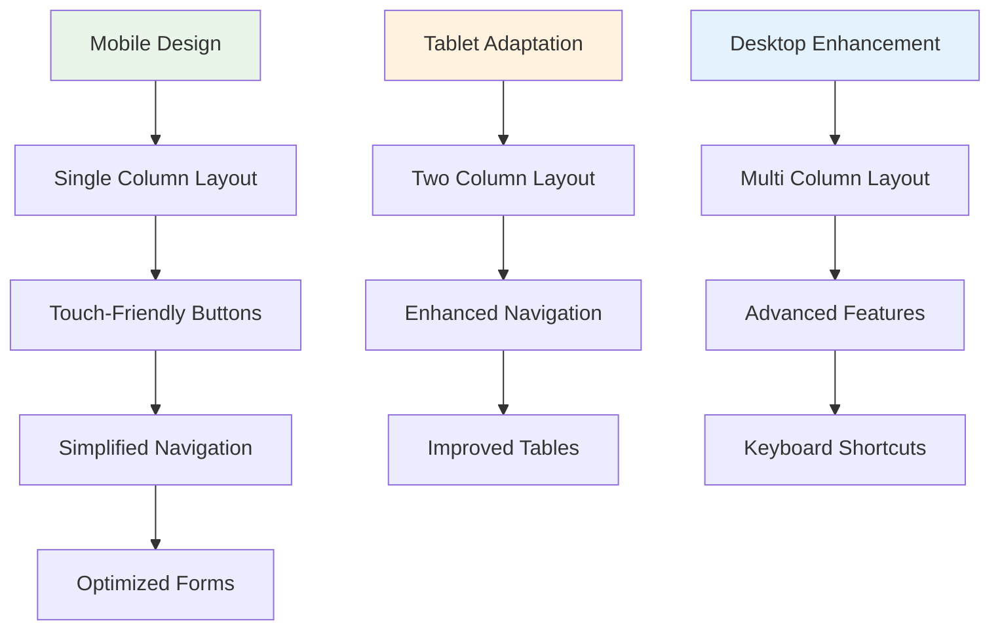

---

## 🎯 **Key User Flows**

### **1. Project Creation Flow**

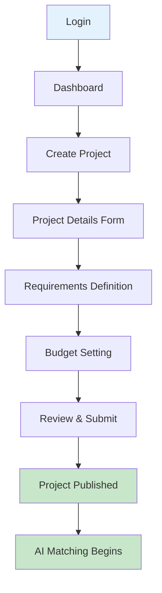

### **2. Interview Scheduling Flow**

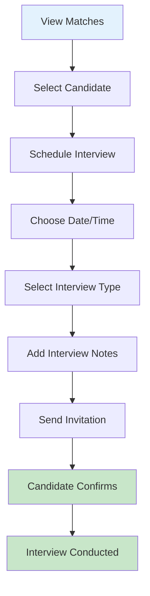

### **3. Payment Processing Flow**

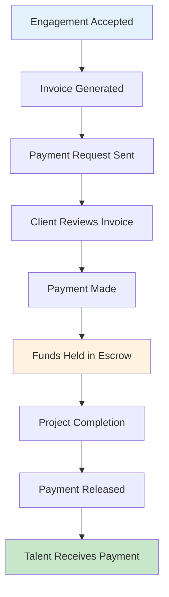

---

## 🎨 **Visual Design Elements**

### **Status Indicators**

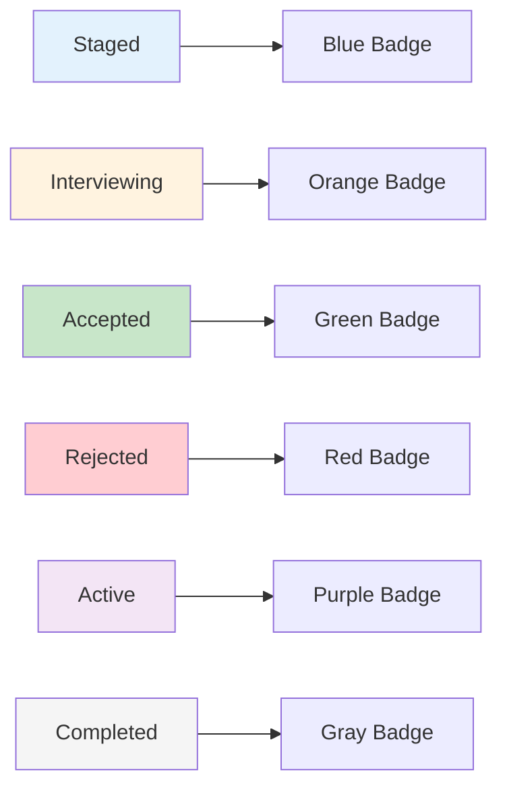

### **Progress Indicators**

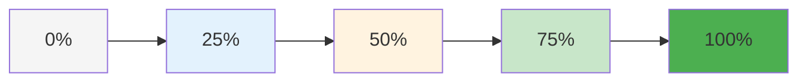

### **Notification System**

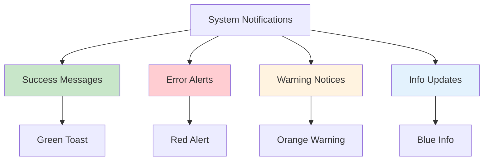

---

## 🎯 **User Interface Patterns**

### **Dashboard Layout**

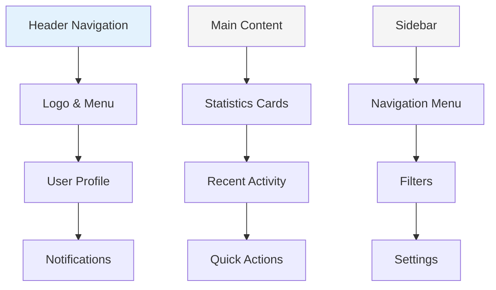

### **Card Design Pattern**

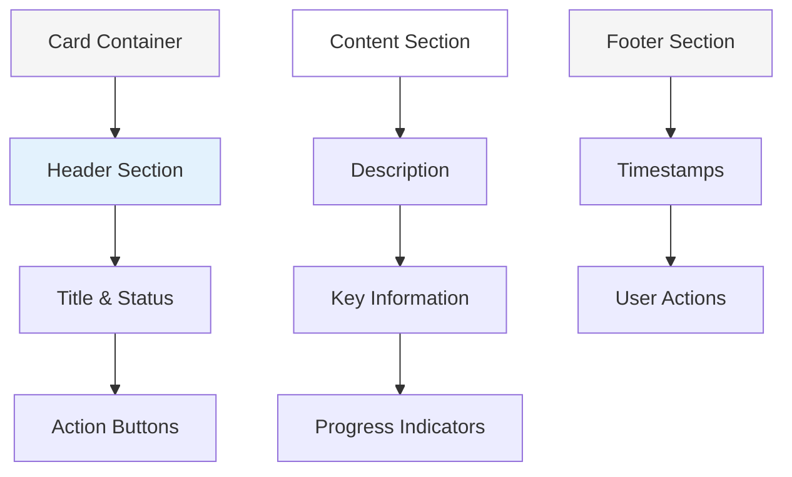

### **Form Design Pattern**

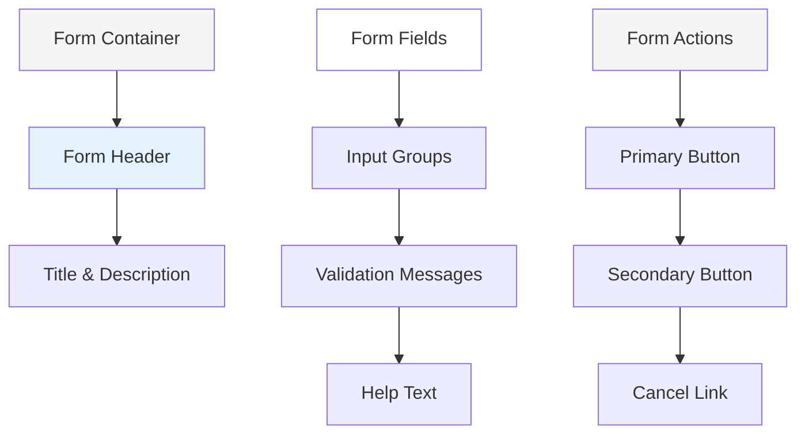

---

## 🎨 **Micro-Interactions**

### **Loading States**

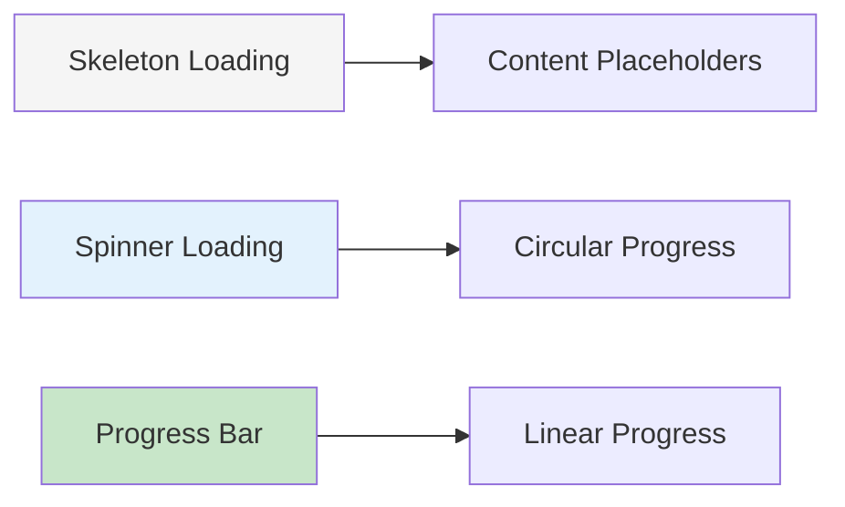

### **Hover Effects**

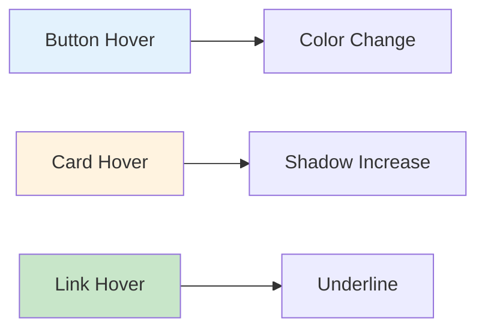

### **Transitions**

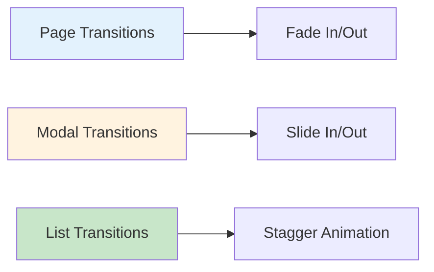

---

## 🎯 **Accessibility Features**

### **Keyboard Navigation**

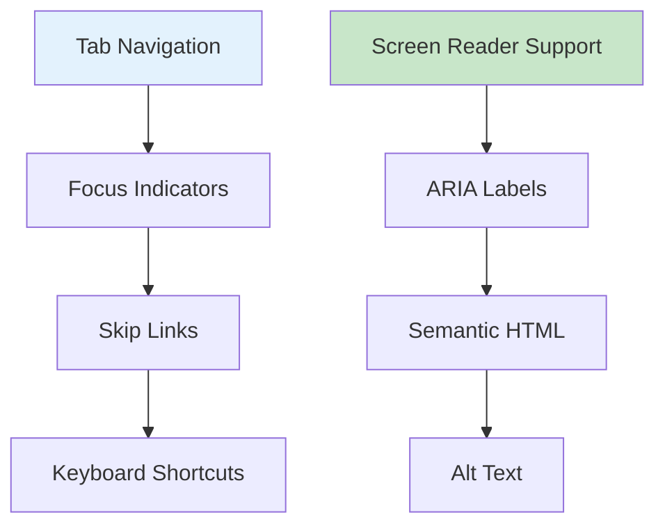

### **Visual Accessibility**

```mermaid
graph LR
    A[High Contrast] --> B[Color Contrast Ratios]
    C[Font Scaling] --> D[Responsive Typography]
    E[Focus Indicators] --> F[Clear Visual Cues]
    
    style A fill:#e3f2fd
    style C fill:#fff3e0
    style E fill:#c8e6c9
```

---

## 📊 **User Experience Metrics**

### **Performance Metrics**

```mermaid
graph LR
    A[Page Load Time] --> B[< 2 seconds]
    C[Time to Interactive] --> D[< 3 seconds]
    E[First Contentful Paint] --> F[< 1.5 seconds]
    
    style A fill:#e8f5e8
    style C fill:#c8e6c9
    style E fill:#4caf50
```

### **User Engagement Metrics**

```mermaid
graph TD
    A[User Engagement] --> B[Session Duration]
    B --> C[Pages per Session]
    C --> D[Bounce Rate]
    D --> E[Return Rate]
    
    F[Task Completion] --> G[Success Rate]
    G --> H[Error Rate]
    H --> I[Time to Complete]
    
    style A fill:#e3f2fd
    style F fill:#c8e6c9
```

### **Satisfaction Metrics**

```mermaid
graph LR
    A[User Satisfaction] --> B[4.8/5 Rating]
    C[Net Promoter Score] --> D[75+ Score]
    E[Customer Effort Score] --> F[Low Effort]
    
    style A fill:#e8f5e8
    style C fill:#c8e6c9
    style E fill:#4caf50
```

---

## 🎨 **Brand Guidelines**

### **Visual Identity**

```mermaid
graph TD
    A[Brand Colors] --> B[Primary Blue]
    A --> C[Secondary Green]
    A --> D[Accent Orange]
    
    E[Typography] --> F[Primary Font]
    E --> G[Secondary Font]
    E --> H[Display Font]
    
    I[Imagery] --> J[Professional Photos]
    I --> K[Clean Icons]
    I --> L[Minimal Graphics]
    
    style A fill:#e3f2fd
    style E fill:#fff3e0
    style I fill:#c8e6c9
```

### **Voice and Tone**

```mermaid
graph LR
    A[Professional] --> B[Trustworthy]
    C[Friendly] --> D[Approachable]
    E[Efficient] --> F[Direct]
    
    style A fill:#e3f2fd
    style C fill:#fff3e0
    style E fill:#c8e6c9
```

---

## 🚀 **Future Enhancements**

### **Planned Features**

```mermaid
graph TD
    A[AI Enhancements] --> B[Smart Recommendations]
    A --> C[Automated Matching]
    A --> D[Predictive Analytics]
    
    E[Mobile App] --> F[Native iOS App]
    E --> G[Native Android App]
    E --> H[Offline Capabilities]
    
    I[Advanced Features] --> J[Video Interviews]
    I --> K[Real-time Chat]
    I --> L[File Sharing]
    
    style A fill:#f3e5f5
    style E fill:#e8f5e8
    style I fill:#fff3e0
```

### **User Experience Improvements**

```mermaid
graph LR
    A[Personalization] --> B[Custom Dashboards]
    C[Automation] --> D[Workflow Automation]
    E[Integration] --> F[Third-party Tools]
    
    style A fill:#e3f2fd
    style C fill:#fff3e0
    style E fill:#c8e6c9
```

---

## 📞 **User Support**

### **Help Resources**

```mermaid
graph TD
    A[Help Center] --> B[Knowledge Base]
    A --> C[Video Tutorials]
    A --> D[FAQ Section]
    
    E[Support Channels] --> F[Live Chat]
    E --> G[Email Support]
    E --> H[Phone Support]
    
    I[Community] --> J[User Forum]
    I --> K[Success Stories]
    I --> L[Best Practices]
    
    style A fill:#e3f2fd
    style E fill:#c8e6c9
    style I fill:#fff3e0
```

---

**This user experience guide ensures that every interaction with the Benchwarmers platform is intuitive, efficient, and delightful for all users! 🎨✨**
