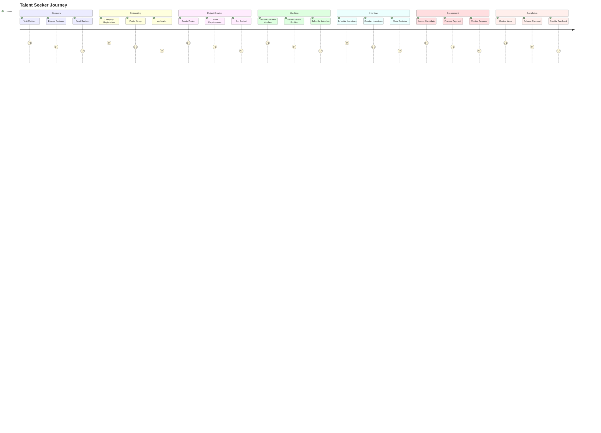
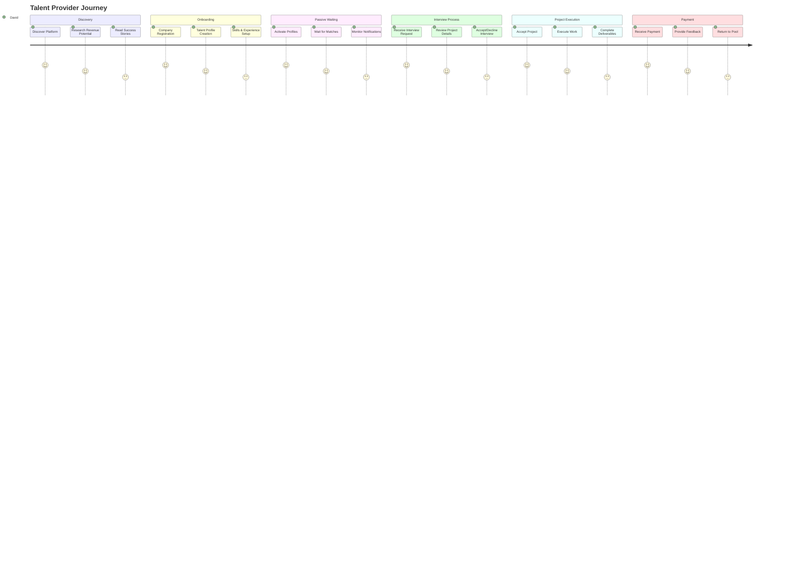
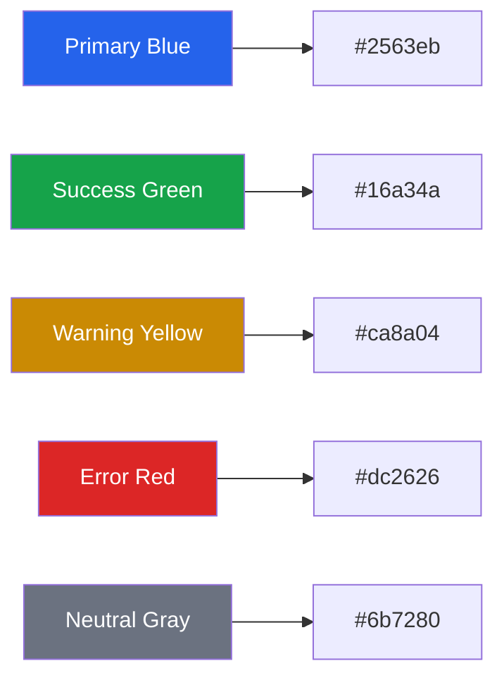
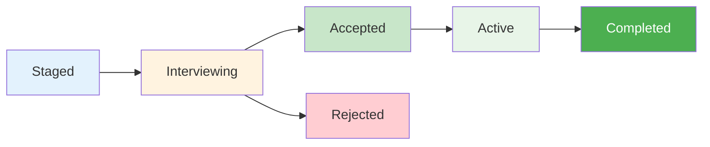
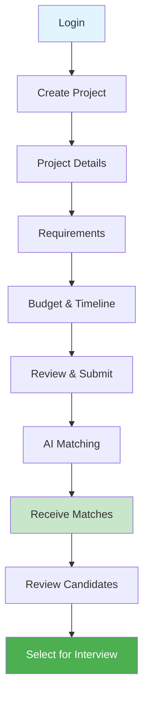
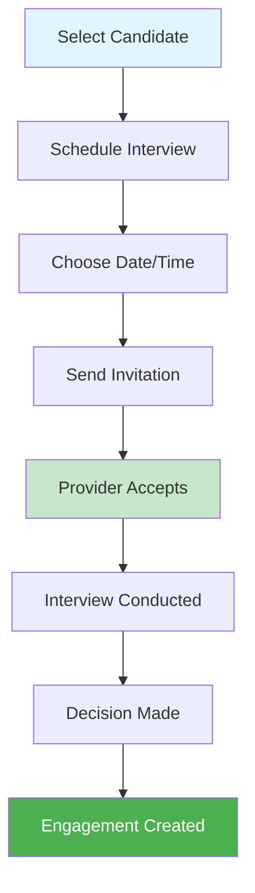
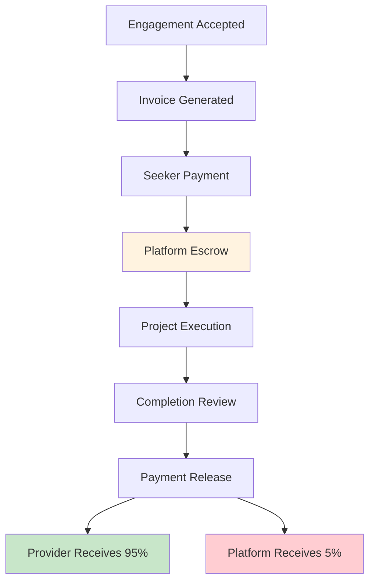
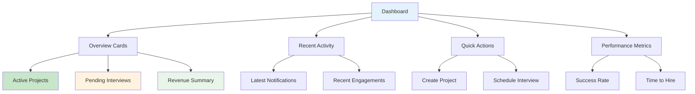

# User Experience Guide
## Benchwarmers Marketplace Platform

---

## 🎨 **Design Philosophy**

Our platform is built on the principles of **simplicity**, **efficiency**, and **transparency**. Every interaction is designed to reduce friction and maximize value for all users.

### **Core Design Principles**
- 🎯 **User-Centric**: Every feature serves a clear user need
- ⚡ **Efficiency-First**: Minimize clicks, maximize results
- 🔍 **Transparency**: Clear visibility into all processes
- 🛡️ **Trust-Building**: Secure, reliable, and professional
- 🚫 **Anti-Spam**: No unsolicited applications - only curated matches

---

## 👥 **User Personas**

### **Talent Seeker (Company with Projects)**
- **Name**: Sarah, HR Director at TechCorp
- **Goals**: Hire quality talent quickly and cost-effectively
- **Pain Points**: Long hiring cycles, high recruitment costs, poor candidate quality, spam applications
- **Success Metrics**: Time-to-hire, cost-per-hire, candidate satisfaction, no spam

### **Talent Provider (Company with Benched Talent)**
- **Name**: David, Managing Director at DevStudio
- **Goals**: Monetize benched professionals during downtime
- **Pain Points**: Idle resources, revenue loss during bench time, complex application processes
- **Success Metrics**: Revenue generation, resource utilization, passive income

### **Platform Administrator**
- **Name**: Maria, Platform Operations Manager
- **Goals**: Ensure smooth operations and maximize platform revenue
- **Pain Points**: Manual processes, poor visibility, operational inefficiencies
- **Success Metrics**: Platform revenue, user satisfaction, operational efficiency

---

## 🔄 **User Journey Maps**

### **Talent Seeker Journey (Companies with Projects)**

### **Talent Provider Journey (Companies with Benched Talent)**

---

## 🎨 **Interface Design System**

### **Color Palette**

### **Typography**
- **Headings**: Inter, bold, scalable
- **Body Text**: Inter, regular, readable
- **Code**: JetBrains Mono, monospace
- **Hierarchy**: Clear visual hierarchy with consistent spacing

### **Component Library**

#### **Status Indicators**

#### **Match Quality Indicators**
- 🟢 **Excellent Match** (90-100%): High confidence, recommended
- 🟡 **Good Match** (70-89%): Good fit, worth considering
- 🟠 **Fair Match** (50-69%): Acceptable, review carefully
- 🔴 **Poor Match** (<50%): Not recommended

---

## 📱 **Responsive Design Strategy**

### **Mobile-First Approach**
- **Breakpoints**: 320px, 768px, 1024px, 1440px
- **Touch Targets**: Minimum 44px for mobile interactions
- **Navigation**: Collapsible menu for mobile devices
- **Forms**: Optimized for mobile input

### **Desktop Enhancements**
- **Multi-column Layouts**: Better use of screen real estate
- **Keyboard Shortcuts**: Power user features
- **Advanced Filtering**: Complex search and filter options
- **Bulk Actions**: Efficient management of multiple items

---

## 🔄 **Key User Flows**

### **Project Creation Flow**

### **Interview Scheduling Flow**

### **Payment Processing Flow**

---

## 🎯 **Visual Design Elements**

### **Status Badges**
- **Staged**: Blue badge with clock icon
- **Interviewing**: Orange badge with calendar icon
- **Accepted**: Green badge with checkmark icon
- **Rejected**: Red badge with X icon
- **Active**: Purple badge with play icon
- **Completed**: Gray badge with trophy icon

### **Progress Indicators**
- **Linear Progress**: For multi-step processes
- **Circular Progress**: For completion percentages
- **Step Indicators**: For interview workflow stages
- **Loading States**: Skeleton screens and spinners

### **Notification System**
- **Success**: Green toast with checkmark
- **Warning**: Yellow toast with alert icon
- **Error**: Red toast with error icon
- **Info**: Blue toast with info icon

---

## 🎨 **UI Patterns**

### **Dashboard Pattern**

### **Card Pattern**
- **Consistent Spacing**: 16px padding, 8px margins
- **Shadow System**: Subtle shadows for depth
- **Hover States**: Interactive feedback
- **Loading States**: Skeleton content

### **Form Pattern**
- **Progressive Disclosure**: Show only relevant fields
- **Inline Validation**: Real-time feedback
- **Error Handling**: Clear error messages
- **Success States**: Confirmation feedback

---

## ⚡ **Micro-interactions**

### **Hover Effects**
- **Subtle Scaling**: 1.02x scale on hover
- **Color Transitions**: Smooth color changes
- **Shadow Elevation**: Increased shadow on hover
- **Icon Animations**: Rotate, bounce, or pulse

### **Loading States**
- **Skeleton Screens**: Placeholder content
- **Progress Bars**: Linear progress indicators
- **Spinners**: Circular loading animations
- **Pulse Effects**: Subtle breathing animations

### **Success Feedback**
- **Checkmark Animations**: Animated success icons
- **Confetti Effects**: Celebration animations
- **Toast Notifications**: Temporary success messages
- **Color Transitions**: Green success states

---

## ♿ **Accessibility Features**

### **Keyboard Navigation**
- **Tab Order**: Logical tab sequence
- **Focus Indicators**: Clear focus states
- **Keyboard Shortcuts**: Power user features
- **Skip Links**: Skip to main content

### **Screen Reader Support**
- **ARIA Labels**: Descriptive labels for elements
- **Semantic HTML**: Proper heading structure
- **Alt Text**: Descriptive image alt text
- **Live Regions**: Dynamic content announcements

### **Visual Accessibility**
- **Color Contrast**: WCAG AA compliance
- **Font Scaling**: Responsive typography
- **Motion Reduction**: Respect user preferences
- **High Contrast Mode**: Enhanced visibility

---

## 📊 **UX Metrics**

### **Performance Metrics**
- **Page Load Time**: < 2 seconds
- **Time to Interactive**: < 3 seconds
- **First Contentful Paint**: < 1.5 seconds
- **Largest Contentful Paint**: < 2.5 seconds

### **User Engagement Metrics**
- **Session Duration**: Average 15 minutes
- **Pages per Session**: Average 8 pages
- **Bounce Rate**: < 30%
- **Return Rate**: > 70%

### **Task Completion Metrics**
- **Project Creation**: 95% completion rate
- **Interview Scheduling**: 90% completion rate
- **Payment Processing**: 99% success rate
- **Profile Setup**: 85% completion rate

---

## 🎨 **Brand Guidelines**

### **Voice and Tone**
- **Professional**: Trustworthy and reliable
- **Friendly**: Approachable and helpful
- **Confident**: Assured and competent
- **Clear**: Simple and understandable

### **Visual Identity**
- **Logo Usage**: Consistent placement and sizing
- **Color Usage**: Brand color guidelines
- **Typography**: Brand font hierarchy
- **Imagery**: Professional and diverse

---

## 🚀 **Future Enhancements**

### **Planned Features**
- **Mobile App**: Native iOS and Android applications
- **Advanced Analytics**: Detailed performance insights
- **AI Chatbot**: Intelligent customer support
- **Video Interviews**: Integrated video calling

### **UX Improvements**
- **Personalization**: Customized user experiences
- **Gamification**: Achievement and reward systems
- **Social Features**: Community and networking
- **Advanced Search**: AI-powered search capabilities

---

## 📞 **User Support**

### **Help Resources**
- **Knowledge Base**: Comprehensive documentation
- **Video Tutorials**: Step-by-step guides
- **FAQ Section**: Common questions and answers
- **Contact Support**: Direct support channels

### **Feedback Channels**
- **In-App Feedback**: Built-in feedback forms
- **User Surveys**: Regular satisfaction surveys
- **Beta Testing**: Early access to new features
- **Community Forum**: User community discussions

---

**Benchwarmers - Where Quality Meets Opportunity**

*Proudly developed by [TOSH (The Only Software Hub)](https://tosh.co.za/)*
